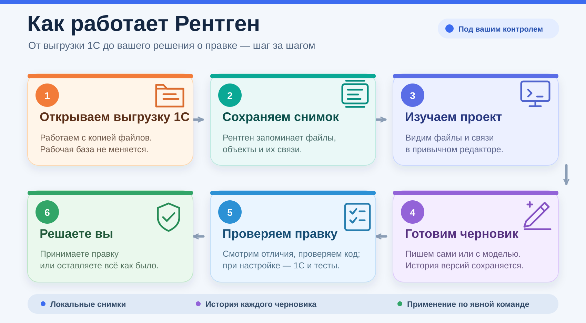

  
  
  

<a href="GETTING_STARTED.md"><b>Начать работу</b></a> · <a href="https://github.com/DmitrL-dev/1cai-public/releases">Скачать</a> · <a href="ROADMAP.md">План развития</a> · <a href="docs/product/AUDIT-20260912.md">Аудит</a> · <a href="docs/product/COMPETITOR-MATRIX.md">Рынок и позиционирование</a> · <a href="CONTRIBUTING.md">Участвовать</a>

Рентген помогает разрабатывать и разбирать конфигурации 1С: фиксирует исходники
в снимках, связывает код с графом зависимостей и сохраняет предложения агента
в отдельных черновиках с историей. Вы видите, что изменилось и что проверено.

**Полностью открытый собственный код под MIT.** Ядро, CLI, MCP, расширение
редактора и адаптер локальной модели доступны для самостоятельной сборки
и доработки. Обязательной подписки на сервис Рентгена нет. Платформа 1С,
модели и сторонние инструменты распространяются на своих условиях.

> **Ранний доступ — проверенные компоненты, продукт ещё развивается.**
> Текущий профиль: Windows x64, Python 3.11; [core `0.1.0.dev10`](https://github.com/DmitrL-dev/1cai-public/releases/tag/core-v0.1.0-dev10), [Companion `0.1.10`](https://github.com/DmitrL-dev/1cai-public/releases/tag/companion-v0.1.10).
> На 1С 8.3.27.2342 проверены синтетические сценарии компиляции и тестирования.
> Отдельно подтверждены запись, чтение, переименование Article → SKU и удаление
> данных в принадлежащей синтетической базе ([evidence](docs/product/NATIVE-BUSINESS-ROUNDTRIP-20260913.md)).
> Для установленного dev10 отдельно проверены ограниченное BSL apply/Undo и
> выполнение на новой синтетической базе ([evidence](docs/product/PROPOSAL-LIVE-APPLY.md#installed-dev10-follow-up-on-native-1c)).
> Типовые конфигурации и живая ИБ ещё не приняты.

Начиная с dev8 доступны
[сравнение сохранённых снимков](docs/product/SNAPSHOT-DIFF.md) и
[локальный observer выгрузки](docs/product/OBSERVER.md): захват при изменении,
сохранённые отчёты и восстановление после сбоя без запросов к LLM.
Также доступна [проверка предложения компилятором 1С](docs/product/PROPOSAL-PLATFORM-CHECK.md)
на отдельной базе из сохранённой выгрузки.
Из редактора можно запустить [BSL-проверку](docs/product/EDITOR-BSL-CHECK.md),
проверку компилятором и [тесты сохранённой версии](docs/product/EDITOR-TESTS.md),
а затем восстановить отчёт без повторного запуска. Устанавливайте dev10
в отдельное окружение по инструкции ниже.
Опубликованный Companion 0.1.10 отдельно прошёл
[нативный editor-to-platform сценарий с установленным core dev10](docs/product/EDITOR-TESTS.md).

### Что можно сделать сейчас

| Сценарий | Что уже работает |
| :--- | :--- |
| Разобраться в проекте | Захват выгрузки, неизменяемые снимки, поиск модулей, чтение кода, граф и анализ влияния |
| Дать агенту контекст | Локальный stdio MCP; профиль редактора ограничивает проект и доступные инструменты |
| Подготовить правку | Отдельные черновики, версии, сравнение, проверка конфликтов при записи и квитанции операций |
| Применить правку в копии | CLI workspace create/apply/undo/status/recover с проверкой inventory, backup, re-read и явным восстановлением; native EDT adapter повторяет выбранный preview и публикует только в новую принадлежащую копию с CAS undo |
| Применить поддержанную правку в исходнике | Direct writer для одного base Designer XML слоя и `rename_catalog_attribute`, а также отдельный BSL proposal writer для одного существующего файла; оба с атомарным journal, CAS undo и явным recovery; [метаданные](docs/product/METADATA-LIVE-APPLY.md), [BSL](docs/product/PROPOSAL-LIVE-APPLY.md) |
| Работать в редакторе | Деревья модулей и черновиков в VSCodium, поиск, история и сравнение версий |
| Проверить предложение модели | Один запрос к локальной Ollama, диагностика BSL до и после, сохранённая ревизия и восстановление результата |
| Проверить сохранённую версию | BSL, компилятор 1С и доверенный профиль YAxUnit на отдельных базах; отчёты по конкретной ревизии |
| Квалифицировать бизнес-данные (host-only) | Нативная запись/чтение, переименование Article → SKU, повторное открытие и удаление в синтетическом каталоге; [доказательство](docs/product/NATIVE-BUSINESS-ROUNDTRIP-20260913.md). Это не поставленная CLI-команда. |
| Архивировать native-run | Явный admin-only CLI/MCP logical archive с проверенным audit, сохранением evidence и UUID; слот retained освобождается логически, дисковое место не удаляется |
| Получать отчёты владельца | MCP/CLI чтение запечатанных owner reports по точному проекту и snapshot; список ограничен, путь к хранилищу не задаётся клиентом |
| Следить за выгрузкой | Сравнение снимков и observer с сохранёнными отчётами без обращений к модели |
| Принять уведомление локально | [HTTPS/ASGI-приёмник](docs/product/NOTIFICATION-RECEIVER.md) dev10 принимает `POST /notifications`, сохраняет digest-квитанцию и безопасно отвечает на повтор; проверен на loopback TLS с закреплённым Uvicorn/httptools. Публичная служба не развёрнута. |

Таблица описывает опубликованный core-v0.1.0-dev10. Предыдущий dev9 сохраняет
перечисленные сценарии, но не содержит новую ASGI-границу. Архивный dev8 не
содержит workspace writer, EDT planner и новых native adapters.

Начиная с dev9 доступен [план и preview правки метаданных через EDT](docs/product/METADATA-PREVIEW.md):
переименование реквизита по сохранённому снимку, проверка UUID и два отдельных diff.
Также доступны отдельные библиотеки [подготовки apply](docs/product/METADATA-APPLY.md),
[принадлежащей workspace-копии](docs/product/METADATA-WORKSPACE.md),
[квалификации metadata candidate](docs/product/METADATA-APPLY-GATE.md) и
[Git-находок](docs/product/GIT-FINDINGS.md), а также bounded
[Git watcher](docs/product/GIT-WATCHER.md) с BSL-LS analyzer adapter
([описание](docs/product/GIT-BSL-ANALYZER.md)): preconditions и lifecycle Git-находок
доступны через observer CLI и watcher adapter, а metadata gate остаётся read-only.
В ветке разработки schema 3 добавляет bounded автономный режим: trusted scanner
сначала создаёт принадлежащий snapshot, затем Git-находки связываются с точным
commit и owner receipt; отзыв прав, ancestry, race и restart проверяются
fail-closed. Live SCM/1С deployment в этот режим не входит.
События watcher можно явно отправить из durable outbox через
[HTTPS webhook](docs/product/NOTIFICATION-DELIVERY.md) с ограничением размера,
allowlist получателей и подтверждением только после HTTP 2xx.
В dev10 [receiver core](docs/product/NOTIFICATION-RECEIVER.md) проверяет
bearer/idempotency и сохраняет durable digest receipt в SQLite: повтор того
же уведомления не создаёт вторую запись, а изменённый envelope под тем же
ключом даёт conflict. ASGI-граница проверена с локальным TLS-хостом
Uvicorn/httptools; публичный HTTPS/DNS-хост и downstream обработка ещё не приняты.
Формат [owner report](docs/product/OWNER-REPORT.md) связывает quality findings и
подтверждённые runtime-метрики; generic и register adapters читают retained
evidence с no-follow проверкой, а без подтверждённого runtime adapter
бизнес-значения остаются `not_available`.
Observer умеет собрать такой отчёт из durable findings для опубликованного
snapshot без повторного запуска Git/LLM; для статуса quality вызывающий слой
должен явно передать `snapshot_id` в ручной `record_findings`; GitWatcher при
чистом tracked source автоматически добавляет проверяемое Git/snapshot evidence,
а лимит выдачи
`max_findings` выбирается явно. Сохранение receipt остаётся отдельной
операцией owner-report store; команда `owner-report-build` выполняет эту сборку
и сохранение без промежуточного JSON.
Подробности [Git/snapshot evidence](docs/product/GIT-SNAPSHOT-EVIDENCE.md).
Для snapshot-анализа добавлены read-only [EDT-инвентарь UUID и владельцев](docs/product/EDT-INVENTORY-IDENTITY.md)
для компактных `.mdo` и реальных `MetaDataObject/*.xml` с отдельными формами и командами
и [семантические companion-scope для three-way](docs/product/METADATA-THREE-WAY-SEMANTICS.md).
Для трёх сохранённых inventory доступен [EDT identity three-way plan](docs/product/EDT-IDENTITY-THREE-WAY.md)
с UUID/owner/layer evidence и CLI `edt-inventory-plan`.
Для EDT-каталогов добавлено отдельное read-only [доказательство вложенных реквизитов](docs/product/EDT-ATTRIBUTE-THREE-WAY.md)
с UUID непосредственного владельца и fail-closed проверкой переноса между типами объектов.
Сформированный owner report можно сохранить и прочитать через
[durable store и CLI](docs/product/OWNER-REPORT-STORE.md); каталог привязан к state-root проекта.
Для обновлений есть [three-way plan и candidate](docs/product/THREE-WAY-UPDATES.md):
он различает сохранение доработки, принятие upstream и конфликт по хэшу, а для
однозначных path-level решений собирает bounded in-memory candidate с digest.
Для Designer XML доступен отдельный [qualified property candidate](docs/product/METADATA-THREE-WAY.md),
который объединяет только раздельные прямые `Properties` и сохраняет исходные
namespace/QName-фрагменты.
Исходное дерево при создании candidate не меняется. Для ограниченного сценария
`rename_catalog_attribute` в ветке разработки доступен отдельный
[live writer](docs/product/METADATA-LIVE-APPLY.md); остальные операции метаданных
по-прежнему требуют собственных producer, платформенной проверки и rollback.

Исходная конфигурация не меняется при создании черновика. Отсутствие ошибок BSL
не подтверждает правильность бизнес-логики и не разрешает применение.

### Как устроен Рентген

[Открыть схему в полном размере](docs/assets/how-rentgen-works.svg).

Источник истины — локальное ядро. Модель предлагает текст; адаптер и ядро
проверяют структуру операций, права и ожидаемую ревизию. Восстановление по
квитанции не повторяет запрос модели или запись.

### Начать с проверенного сценария

1. Установите [офлайн-комплект ядра](GETTING_STARTED.md) в отдельное окружение.
2. Зарегистрируйте папку выгрузки и создайте первый снимок.
3. Подключите [профиль VSCodium / Cline](integrations/open-editor/README.md).
4. Откройте модуль, сохраните черновик и проверьте сравнение.

Для просмотра модель не нужна. Для управляемой локальной правки нужны Ollama
с установленной моделью и закреплённый runtime BSL. Проверен один искусственный
сценарий на Qwen3.5:9b; это не оценка качества на произвольных задачах 1С.

### Куда движемся

Приоритет — проверяемая ежедневная разработка 1С: от понимания конфигурации
до безопасного обновления с сохранением доработок. Затем — постоянный аудит
и отчёты о состоянии продукта для владельца.

| Следующий этап | Критерий готовности |
| :--- | :--- |
| Ежедневная AI-разработка | Репрезентативные задачи, предсказуемые затраты, проверки и удобное ревью |
| Работа с объектами без GUI Конфигуратора | Явная матрица поддерживаемых объектов и проверка результатов платформой |
| Обновление конфигураций | Сохранение доработок, объяснимые конфликты, тестовый прогон и восстановление |
| Непрерывный аудит | Анализ новых снимков без лишних запросов модели, отчёты с источниками метрик |
| Защита через Spectorn | Проверенный маршрут к upstream, поведение при отказе и подтверждение защиты |

Эти возможности **не объявлены готовыми**. Spectorn пока не подключён
к управляемому адаптеру правки. Подробности и порядок — в [плане развития](ROADMAP.md).

### Документация и исходники

| Раздел | Содержание |
| :--- | :--- |
| [Установка](GETTING_STARTED.md) | Готовые файлы, контрольные суммы, первый проект |
| [Ядро и MCP](docs/product/CORE-MCP.md) | Контракты, права, ограничения и восстановление |
| [Расширение](integrations/vscode-rentgen/README.md) | Просмотр, черновики и локальная правка |
| [Архитектура](ARCHITECTURE.md) | Границы модулей и источник истины |
| [Готовность](docs/product/READINESS.md) | Что проверено и что ещё предстоит |
| [Workspace apply](docs/product/METADATA-WORKSPACE.md) | Запись, проверка inventory и undo в принадлежащей копии |
| [Live Designer XML apply](docs/product/METADATA-LIVE-APPLY.md) | Прямое применение поддержанного rename в исходнике с CAS undo/recovery |
| [Direct BSL proposal apply](docs/product/PROPOSAL-LIVE-APPLY.md) | Узкий live writer для одного существующего BSL-файла с запечатанным journal, CAS undo и явным recovery |
| [Owner report](docs/product/OWNER-REPORT.md) | Источники quality и runtime-метрик с fail-closed статусами и durable receipts |
| [Owner report store](docs/product/OWNER-REPORT-STORE.md) | Иммутабельные receipts и локальный CLI сохранения/чтения по snapshot |
| [Runtime metrics](docs/product/RUNTIME-METRICS.md) | Bounded JSON-export adapter с двойной авторизацией и точной привязкой к snapshot |
| [Notification receiver](docs/product/NOTIFICATION-RECEIVER.md) | Durable digest receipts, bearer check и conflict-safe deduplication для outbox; в dev10 локальный HTTPS/ASGI-путь проверен с Uvicorn/httptools, публичный host и downstream обработка не приняты |
| [Service host](docs/product/SERVICE-HOST.md) | Native ServiceMain boundary для Observer и bounded foreground Git host с cooperative stop и fail-closed lifecycle; live SCM deployment ещё не принят |
| [Three-way updates](docs/product/THREE-WAY-UPDATES.md) | Plan и безопасный in-memory candidate для base/current/upstream по хэшу |
| [UUID-aware updates](docs/product/METADATA-THREE-WAY.md) | Консервативное сопоставление объектов Designer XML по типу и UUID |
| [EDT identity inventory](docs/product/EDT-INVENTORY-IDENTITY.md#local-cli) | CLI `edt-inventory`: профили для `.mdo` и реальных `MetaDataObject/*.xml`, проверенные UUID, владельцы форм/команд и evidence слоя в явно выбранном опубликованном EDT snapshot; partial coverage |
| [EDT identity three-way](docs/product/EDT-IDENTITY-THREE-WAY.md) | CLI `edt-inventory-plan`: сравнение трёх сохранённых inventory по UUID/owner/layer; partial read-only evidence |
| [EDT attribute three-way](docs/product/EDT-ATTRIBUTE-THREE-WAY.md) | Read-only evidence реквизитов Catalog с UUID владельца и хэшами; CLI `edt-attribute-plan` для трёх ограниченных JSON-деревьев |
| [ibcmd fixture executor](docs/product/EDT-FIXTURE-EXECUTOR.md) | Принадлежащий bounded create/import/export цикл с квитанциями, удержанием входов и без live apply |
| [Three-way semantics](docs/product/METADATA-THREE-WAY-SEMANTICS.md) | Atomic BSL/form/СКД scopes с явными supported/conflict/unsupported статусами |
| [Аудит](docs/product/AUDIT-20260912.md) | Приоритетные слабые места и порядок работ |
| [Разработка](CONTRIBUTING.md) | Сборка, тесты и правила изменений |

Текущий публичный состав заменяет прежнее экспериментальное дерево.
Старые портал, демо и интеграции доступны в
[истории до обновления](https://github.com/DmitrL-dev/1cai-public/tree/c4f633d9edb8a2a15c66358adc2e01835820d947).
Их прежние заявления о готовности не относятся к текущей поставке.
