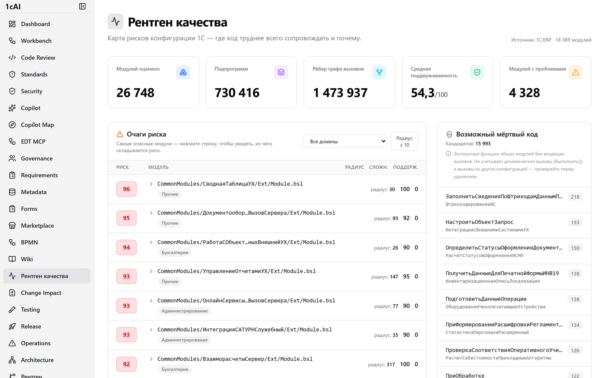
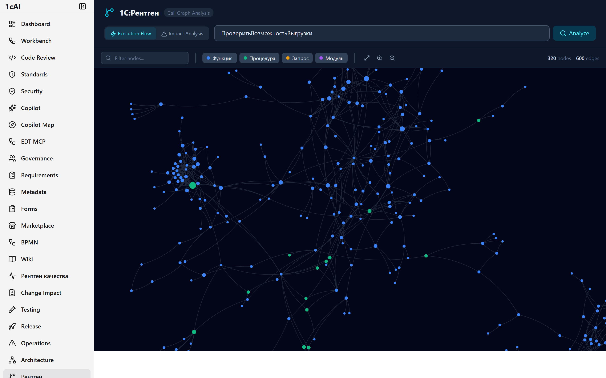
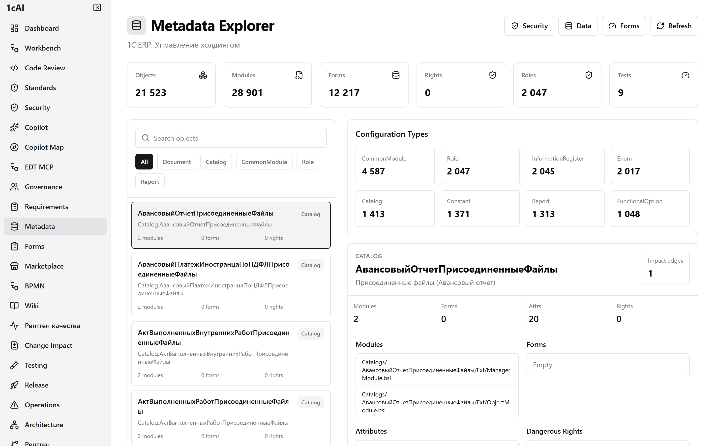
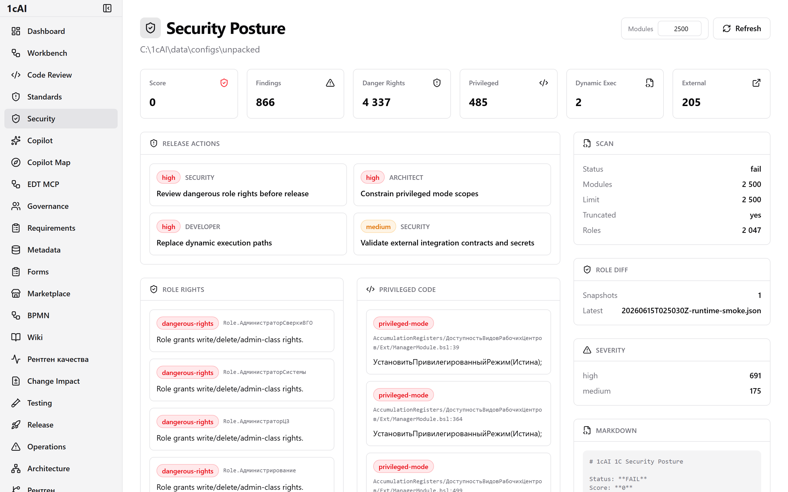
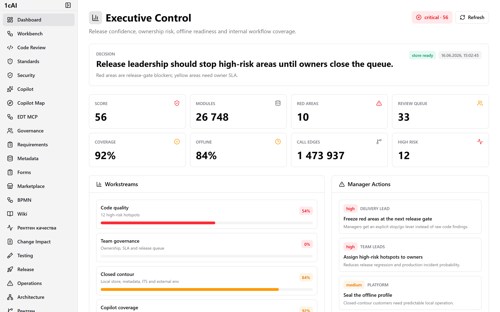
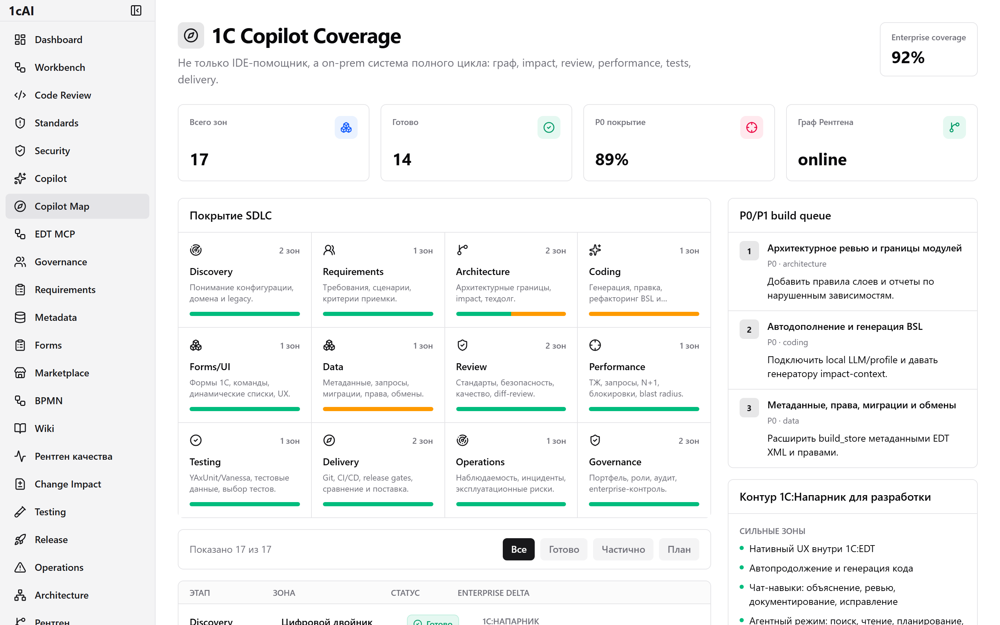
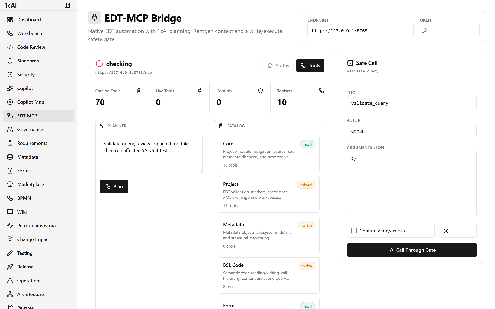
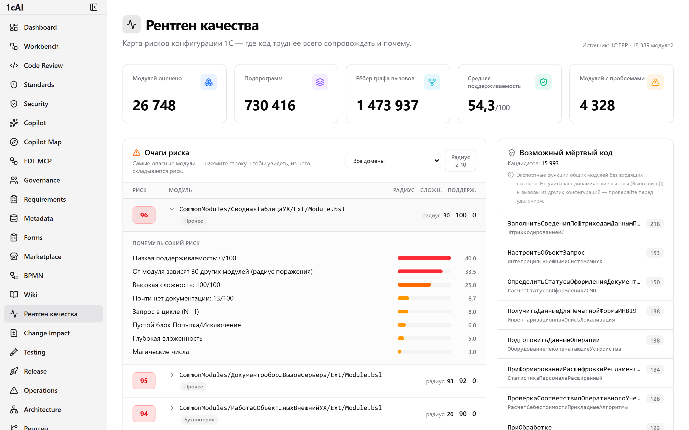
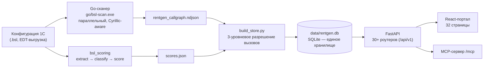

<div align="center">

# 🩻 1С:Рентген

**On-prem AI-экосистема полного цикла разработки и доработки 1С.**
Ядро — **1С:Рентген**: token-free граф вызовов всей конфигурации, анализ влияния изменений, поиск мёртвого кода и _объяснимый_ риск. Поверх него — инструменты на каждый этап: понимание, доработка, ревью, производительность, тесты, релиз, governance — **всё внутри периметра, без отправки кода в облако.**

[](https://www.python.org/downloads/)
[](https://go.dev/)
[](https://react.dev/)
[](LICENSE)
[]()

**32 страницы портала · 30+ областей API · 1 SQLite-файл вместо Neo4j/Docker**

</div>

> **Текущий статус на 2026-06-19:** ядро Рентгена и основные lifecycle-страницы работают как
> pilot-ready продукт. Запуск в dev-профиле выполняется через `scripts/start_rentgen.ps1`, который
> сам задает локальный `ENVIRONMENT=development` и процессный `JWT_SECRET`. `GET /health` — быстрый
> liveness, глубокая диагностика внешних/legacy сервисов вынесена в `GET /health/deep`. ArchiMate
> endpoint доступен по `/api/v1/archi`, но остается legacy-интеграцией поверх старого GraphService,
> поэтому не считается частью Neo4j-free ядра. Главная страница теперь является role-based рабочим
> пультом с demo story, markdown-отчетами по ролям, wizard pre-flight для EDT/Git/XML источников,
> Platform Doctor v1, Lock Radar v1, Extension Safety v1, Update War Room v1, Rights & RLS Simulator v1, Value Packs Center v1,
> Evidence Bundle v1, Enterprise Trust Center Security Questionnaire и Vendor Portfolio audit pack для pre-sale/франчайзи сценариев.
> Change Impact false-safe-zero guard now reaches diff-review, Test Factory and Release Readiness: every zero impact is either measured or carries `coverage_caveat`.

> **Не ещё один копайлот для 1С.** Генеративные ассистенты пишут код; Рентген отвечает на вопросы,
> которые они не закрывают: **что сломается, если я изменю этот модуль? что в конфигурации мёртвое?
> где самый рискованный код — и почему именно?** — и обвязывает это инструментами на весь жизненный цикл.

<div align="center">



<sub>Дашборд «Рентген качества»: KPI всей конфигурации · очаги риска с объяснением · кандидаты в мёртвый код</sub>

</div>

---

## Содержание

- [Зачем это нужно](#зачем-это-нужно)
- [Возможности — экосистема полного цикла](#возможности--экосистема-полного-цикла)
- [Ядро: что проверено на реальной конфигурации](#ядро-что-проверено-на-реальной-конфигурации)
- [Объяснимый риск — ключевая идея](#объяснимый-риск--ключевая-идея)
- [Как это устроено](#как-это-устроено-архитектура)
- [Быстрый старт](#быстрый-старт)
- [API](#api)
- [Методология и честные оговорки](#методология-и-честные-оговорки)
- [Технологический стек](#технологический-стек)
- [Структура проекта](#структура-проекта)
- [Статус и роадмап](#статус-и-роадмап)
- [Тестирование](#тестирование)
- [Лицензия](#лицензия)

---

## Зачем это нужно

Типовые конфигурации 1С (ERP, УТ, ЗУП, УХ) — это **миллионы строк BSL и десятки тысяч модулей**. Боли разработки и доработки:

- **Регрессии при изменениях.** Поправил общий модуль или проведение — что отвалится по всей конфигурации? Вручную радиус поражения не отследить.
- **Легаси и онбординг.** Новый разработчик не удержит в голове граф зависимостей на миллионы строк.
- **Ревью в масштабе.** SonarQube и BSL Language Server видят проблемы **пофайлово** — не строят граф всей конфигурации, не считают impact, не ранжируют риск по ландшафту.
- **Закрытый контур.** Банки, госсектор, оборонка — код **нельзя** отправлять в облако.

Существующие AI-инструменты (1С:Напарник, GigaCode, Cursor + MCP) заняты **генерацией** кода. **Аналитический слой** — граф вызовов, impact, мёртвый код, объяснимый риск — не занят никем, при этом он **структурно проверяем**: граф — это факты, а не вероятности. Рентген занимает эту нишу и расширяет её до экосистемы полного цикла, **token-free** (анализ локально, без LLM) — пригодной для контуров без интернета.

---

## Возможности — экосистема полного цикла

Поверх графа-«цифрового двойника конфигурации» построены инструменты на каждый этап. Зрелость помечена честно:

`✅` проверено на реальной конфигурации · `🟢` работает · `🟡` бета / развивается · `⚪` демо-каркас

#### 🔍 Понимание конфигурации
| Модуль | Что делает | UI · API | |
|---|---|---|:--:|
| **Рентген — граф вызовов** | flow / impact / dead-code / fan-in-out по всей конфигурации | `/rentgen` · `/api/v1/rentgen` | ✅ |
| **Рентген качества** | очаги риска с раскрытием причин | `/quality` · `/api/v1/quality` | ✅ |
| **Граф метаданных** | объекты, реквизиты, измерения, ресурсы, права из EDT-XML | `/metadata` · `/api/v1/metadata` | ✅ |
| **Архитектурный обзор** | подсистемы, зависимости, god-модули | `/architecture` · `/api/v1/architecture` | 🟡 |
| **Формы** | инвентарь и обзор форм | `/forms` | 🟡 |

#### ✏️ Доработка
| Модуль | Что делает | UI · API | |
|---|---|---|:--:|
| **Change Impact** | diff/список модулей → blast radius + задетые очаги + риски + тесты | `/change` · `/api/v1/rentgen/change-impact` | ✅ |
| **Change Sets** | наборы изменений как единица работы | `/api/v1/change-sets` | 🟡 |
| **Requirements traceability** | требования ↔ код ↔ тесты | `/requirements` · `/api/v1/requirements` | 🟡 |
| **Baselines** | базовые срезы конфигурации для сравнения | `/api/v1/baselines` | 🟡 |
| **Copilot / IDE** | генерация, оптимизация, тесты; Monaco + Swarm-review | `/copilot` · `/ide` | 🟢 |
| **Copilot Coverage** | карта покрытия копайлота по доменам | `/copilot-coverage` · `/api/v1/copilot-coverage` | 🟡 |
| **Workbench** | рабочее место разработчика | `/workbench` | 🟡 |

#### 🛡️ Качество и ревью
| Модуль | Что делает | UI · API | |
|---|---|---|:--:|
| **Code Review** | анализ BSL, code smells, авто-фиксы | `/code-review` | 🟢 |
| **Standards Review** | стандарты разработки 1С + диагностики на дифф | `/standards-review` · `/api/v1/quality/review-diff` | 🟢 |
| **Security Posture** | RLS, права, секреты, поверхность атаки | `/security` | 🟡 |
| **Rights & RLS** | матрица роль → объект → действие, опасные права, RLS-сигналы, security gate | `/rights-rls` · `/api/v1/rights-rls/analyze` | 🟡 |
| **Micro-Swarm** | zero-dependency ML-детекторы антипаттернов BSL | `/api/v1/swarm` | 🟢 |

#### ⏱️ Производительность
| Модуль | Что делает | UI · API | |
|---|---|---|:--:|
| **Перформер** | парсер технологического журнала (ТЖ): query-хотспоты, N+1, ожидания на блокировках, дедлоки — с привязкой к строкам BSL | `/api/v1/performer` | 🟢 |

#### 🧪 Тестирование
| Модуль | Что делает | UI · API | |
|---|---|---|:--:|
| **Testing** | инвентарь тестов (YAxUnit/Vanessa), матрица покрытия, раннеры, test-evidence | `/testing` · `/api/v1/testing` | 🟡 |

#### 🚀 Релиз и эксплуатация
| Модуль | Что делает | UI · API | |
|---|---|---|:--:|
| **Release Readiness** | гейты готовности к релизу | `/release-readiness` · `/api/v1/release-readiness` | 🟡 |
| **Update War Room** | план обновления: платформа, расширения, impact, тесты, rollback, evidence | `/update-war-room` · `/api/v1/update-war-room/plan` | 🟡 |
| **Operations / Incident** | операционная панель, инциденты | `/operations` · `/api/v1/operations` | 🟡 |
| **Lock Radar** | ТЖ-блокировки, TTIMEOUT/TDEADLOCK, affected modules, test gaps и runbook | `/lock-radar` · `/api/v1/lock-radar/analyze` | 🟡 |
| **Extension Safety** | CFE/EDT-расширения, права, privileged mode, write hooks, borrowed objects, impact | `/extension-safety` · `/api/v1/extension-safety/analyze` | 🟡 |
| **Offline Readiness** | готовность к работе в закрытом контуре | `/offline-readiness` · `/api/v1/offline-readiness` | 🟡 |
| **Productization** | SBOM, offline-bundle, delivery passport, signed manifest/archive verification, release checklists | `/productization` · `/api/v1/productization` | 🟡 |
| **Monitoring** | Prometheus-метрики | `/monitoring` | 🟢 |

#### 👥 Управление (governance)
| Модуль | Что делает | UI · API | |
|---|---|---|:--:|
| **Policy Engine** | политики и гейты с waiver | `/api/v1/policies` | 🟡 |
| **Approvals** | согласования с разделением полномочий (SoD), constraints и approve/reject UI | `/approvals` · `/api/v1/approvals` | 🟢 |
| **Audit** | tamper-evident hash-chain журнал, проверка цепочки и export UI | `/audit` · `/api/v1/audit` | 🟢 |
| **Enterprise / IAM** | тенанты, проекты, границы доступа | `/api/v1/enterprise` | 🟡 |
| **Team Governance** | команда, роли, доступы | `/team-governance` · `/api/v1/team-governance` | 🟡 |
| **Artifact Graph** | граф артефактов (требования, тесты, waiver'ы) | `/api/v1/artifacts` | 🟡 |
| **Agentic Workflows** | оркестрация шагов/агентов | `/api/v1/agentic` | 🟡 |
| **Value Packs** | покупаемые пакеты продукта: Developer, Architect, Release/QA, Platform, Vendor, Offline | `/value-packs` · `/api/v1/value-packs/catalog` | 🟡 |
| **Killer Demo Path** | buyer-ready route with role sparks, objection router, proof packet, commercial close packet and approval/audit checkout gates | `/killer-demo` · `/api/v1/killer-demo/build` | 🟡 |
| **Board Pack** | director buying motion with value, risks, board close packet and governance checkout gates | `/board-pack` · `/api/v1/board-pack/build` | 🟡 |
| **Pilot Launchpad** | paid activation plan with Day 0/7/30 milestones, buyer commitments, acceptance register and approval/audit gates | `/pilot-launchpad` · `/api/v1/pilot-launchpad/build` | 🟡 |
| **Outcome Ledger** | post-purchase adoption proof with 7/30/60/90 outcomes, acceptance rollup and governance refresh | `/outcome-ledger` · `/api/v1/outcome-ledger/build` | 🟡 |
| **Launch Room** | single buyer cockpit with next action, role paths, buyer journey, acceptance signals and approval/audit proof gates | `/launch-room` · `/api/v1/launch-room/build` | 🟡 |
| **Business Case** | director money map: first-year visible value, AI subscription displacement, buyer committee, objections, 30/60/90 | `/business-case` · `/api/v1/business-case/build` | 🟡 |
| **Evidence Bundle** | единый export/procurement pack: JSON/Markdown артефакты, caveats, governance proof, SHA-256 manifest, ZIP proof archive and buyer handoff | `/evidence-bundle` · `/api/v1/evidence-bundle/build` · `/archive` | 🟡 |
| **Vendor Portfolio** | pre-sale audit pack и multi-client portfolio mode: риск, платформа, work packages, markdown для КП | `/vendor-portfolio` · `/api/v1/vendor-portfolio/audit` · `/portfolio` | 🟡 |

#### 📚 Знания и доставка
| Модуль | Что делает | UI · API | |
|---|---|---|:--:|
| **ITS-RAG** | локальный семантический поиск по документации ИТС | `/api/v1/its` | 🟢 |
| **MCP-сервер** | аналитика Рентгена как MCP-инструменты для Cursor/Claude/EDT | `/mcp` | 🟢 |
| **EDT MCP Bridge** | мост к 1С:EDT, online/offline | `/edt-mcp` · `/api/v1/edt-mcp` | 🟡 |
| **Telegram-бот** | ChatOps-интерфейс | — | 🟢 |
| **Archi (ArchiMate)** | экспорт/импорт TOGAF; legacy GraphService bridge, не часть SQLite-ядра | `/api/v1/archi` | ⚪ |
| **Marketplace · BPMN · Wiki** | плагины · диаграммы · база знаний | `/marketplace` `/bpmn` `/wiki` | ⚪ |

> Всё перечисленное — **on-prem**: ни одна функция не требует облака. Встроены аутентификация **JWT + RBAC**, **tamper-evident аудит** и **разделение полномочий**; раннеры тестов изолированы (allow-list + kill-switch).

### Как это выглядит

<table>
<tr>
<td width="50%"><br/><sub><b>1С:Рентген</b> — интерактивный граф вызовов (Flow / Impact)</sub></td>
<td width="50%"><br/><sub><b>Metadata Explorer</b> — объекты, реквизиты, права (21 523 объекта)</sub></td>
</tr>
<tr>
<td><br/><sub><b>Security Posture</b> — находки, опасные права, привилегированный код</sub></td>
<td><br/><sub><b>Executive Control</b> — сводный статус по конфигурации</sub></td>
</tr>
<tr>
<td><br/><sub><b>Copilot Coverage</b> — карта покрытия SDLC</sub></td>
<td><br/><sub><b>EDT-MCP Bridge</b> — каталог инструментов для 1С:EDT</sub></td>
</tr>
</table>

---

## Ядро: что проверено на реальной конфигурации

Ядро Рентгена прогнано на реальной **1С:ERP УХ** (28 901 BSL-файл):

| Метрика | Значение |
|---|---|
| Подпрограмм в графе | **730 416** |
| Модулей | **18 389** |
| Достоверных рёбер графа вызовов | **1 473 937** |
| Оценённых модулей | **26 748** |
| Покрытие join (граф ↔ оценки) | **91.2 %** |

Это и есть «спина», к которой подключаются все инструменты выше.

---

## Объяснимый риск — ключевая идея

Риск **никогда не чёрный ящик**. Формула прозрачна (`tools/rentgen/store.py`):

```
risk = quality_risk × blast(fan_in)

quality_risk = 0.40·(100 − поддерживаемость)
             + 0.25·сложность
             + 0.10·(100 − документированность)
             + штрафы за антипаттерны   (N+1, пустой catch, deep nesting, … ; ≤ 25)

blast = 0.65 … 1.0   — множитель «радиуса поражения» по fan-in
```

Каждый очаг возвращает `reasons[]` с вкладом каждого фактора. Реальный пример из 1С:ERP:

```json
{
  "module_path": "CommonModules/СводнаяТаблицаУХ/Ext/Module.bsl",
  "risk": 96, "fan_in": 40, "fan_out": 66,
  "reasons": [
    { "factor": "maintainability", "detail": "Низкая поддерживаемость: 0/100", "weight": 40.0 },
    { "factor": "blast_radius",    "detail": "От модуля зависят 40 других модулей", "weight": 33.5 },
    { "factor": "complexity",      "detail": "Высокая сложность: 100/100", "weight": 25.0 },
    { "factor": "antipattern",     "detail": "Запрос в цикле (N+1)", "weight": 8 }
  ]
}
```

---

<div align="center">



<sub>Клик по строке раскрывает «ПОЧЕМУ ВЫСОКИЙ РИСК» — вклад каждого фактора</sub>

</div>

## Как это устроено (архитектура)

Никакого Neo4j и Docker — граф и оценки живут в одном SQLite-файле и отдаются in-process.



**Ключевые решения:**

- **Точность важнее полноты в разрешении вызовов.** Только квалифицированные `Модуль.Функция` (exact/alias) и локальные вызовы; «резолвинг по имени» отключён (отброшено ~3.4 млн неоднозначных рёбер, включая платформенные `Вставить/Добавить/Количество`). Граф можно показывать как факт; топ зависимостей корректен (`ОбщегоНазначения`, `СтроковыеФункцииКлиентСервер`).
- **Формы — в графе.** Go-сканер эмитит форм-модули как `<Объект>.Form`, поэтому impact для форм **измеряется**.
- **Honest-by-default.** Модуль не в графе → `coverage: "no_graph_data"` + оговорка «не измерено ≠ ноль», а не фальшивый «безопасный ноль».

---

## Быстрый старт

**Требования:** Python 3.11, Node.js 20+, (опц.) Go 1.25 для пересборки сканера.

> ⚠️ **Данные не входят в репозиторий.** `rentgen.db`, граф, оценки и любая конфигурация 1С — производные от конкретной (часто проприетарной) конфигурации, поэтому они в `.gitignore`. Репозиторий — это **код**; стенд собирается на вашей конфигурации.

```bash
git clone https://github.com/DmitrL-dev/1cai-public.git
cd 1cai-public
python -m venv .venv && . .venv/bin/activate     # Windows: .venv\Scripts\activate
pip install -r requirements.txt
# Опционально: AI/RAG/legacy Archi GraphService integrations
# pip install -r requirements-optional.txt

# 1) Граф вызовов (соберите бинарь: cd go && go build -o bsl-scan.exe ./cmd/bsl-scan)
go/bsl-scan.exe -mode callgraph /path/to/edt-config > data/rentgen_callgraph.ndjson
# 2) Оценки (пайплайн tools/bsl_scoring → gabriel_runs/scores.json; команды — в docs/RENTGEN.md
#    либо POST /api/v1/quality/score-config {"config_path": "..."} после запуска backend)
# 3) Сборка единого стора (~30 с)
python tools/rentgen/build_store.py             # -> data/rentgen.db

# Запуск
python -m uvicorn src.main:app --host 127.0.0.1 --port 8000
cd portal && npm install && npm run dev          # http://localhost:3000
```

- Рабочий пульт: <http://localhost:3000> · Конфигурации: <http://localhost:3000/configurations> · Platform Doctor: <http://localhost:3000/platform-doctor> · Lock Radar: <http://localhost:3000/lock-radar> · Extension Safety: <http://localhost:3000/extension-safety> · Update War Room: <http://localhost:3000/update-war-room> · Rights/RLS: <http://localhost:3000/rights-rls> · Value Packs: <http://localhost:3000/value-packs> · Business Case: <http://localhost:3000/business-case> · Productization: <http://localhost:3000/productization> · Evidence Bundle: <http://localhost:3000/evidence-bundle> · Vendor Portfolio: <http://localhost:3000/vendor-portfolio> · Дашборд рисков: <http://localhost:3000/quality> · Swagger: <http://127.0.0.1:8000/docs>
- Windows, одной командой: `powershell -ExecutionPolicy Bypass -File scripts\start_rentgen.ps1`.

Подробности и грабли — [`docs/RENTGEN.md`](docs/RENTGEN.md), [`HANDOFF.md`](HANDOFF.md).

---

## API

Всё под `/api/v1` (тела POST с кириллицей — UTF-8). Полный список — в Swagger (`/docs`). Главное:

**`/quality`** — `summary`, `hotspots`, `worst`, `search`, `module`, `stats`, `review-diff`, `standards-review` с Query Surgeon правилом `join-field-null-guard`
**`/rentgen`** — `flow`, `impact`, `change-impact`, `dead-code`, `module-neighbors`, `stats`, `health`
**`/management`** — `executive`, `demo`, `role-report/{role}`, `intake/plan`
**`/platform-doctor`** — локальный inventory платформы 1С, compatibility/DBMS/TJ/OpenMetrics checks и upgrade checklist
**`/lock-radar`** — TLOCK/TTIMEOUT/TDEADLOCK из технологического журнала, affected modules, test gaps, actions и runbook
**`/extension-safety`** — CFE/EDT-расширения, права, privileged mode, write hooks, borrowed objects, impact и update checklist
**`/update-war-room`** — update/upgrade план: platform, extension safety, release impact, tests, rollback/evidence
**`/rights-rls`** — role/object/action matrix, dangerous rights, conservative RLS detection, security gate
**`/value-packs`** — role/product packs, deliverables, proof, routes and no-mandatory-token licensing story
**`/business-case`** — director money map: visible first-year value, AI subscription displacement, buyer committee, objections and 30/60/90 rollout
**`/killer-demo`** — buyer-ready route with role sparks, proof packet, commercial close packet and approval/audit checkout gates
**`/board-pack`** — director buying motion with value, risks, board close packet and governance checkout gates
**`/pilot-launchpad`** — paid activation plan with Day 0/7/30 milestones, buyer commitments and approval/audit gates
**`/outcome-ledger`** — post-purchase adoption proof with 7/30/60/90 outcomes and governance refresh
**`/commercial-offer-studio`** — buyable packages, procurement dossier, close packet, checkout gates and local-vs-AI-rent purchase story
**`/productization`** — enterprise delivery console: readiness, SBOM, offline manifest/archive build, delivery passport and verification
**`/evidence-bundle`** — hashed JSON/Markdown/ZIP export pack with SHA-256 manifest, governance proof and approval/audit evidence
**`/approvals`** — scoped EDT-MCP approval records with create/approve/reject and argument constraints
**`/audit`** — audit-chain verification, recent events and JSONL/JSON export
**`/vendor-portfolio`** — pre-sale audit pack и multi-client portfolio mode для вендора: executive risk, intake, platform readiness, work packages, markdown
**`/performer`** · **`/its`** · **`/metadata`** · **`/requirements`** · **`/change-sets`** · **`/baselines`** · **`/testing`** · **`/release-readiness`** · **`/offline-readiness`** · **`/operations`** · **`/policies`** · **`/approvals`** · **`/audit`** · **`/enterprise`** · **`/team-governance`** · **`/architecture`** · **`/agentic`** · **`/edt-mcp`** · **`/productization`**

---

## Методология и честные оговорки

Инструмент полезен ровно настолько, насколько ему доверяют:

- **Риск — прозрачная формула, не ML-вердикт.** GBR-модель `code_quality` намеренно не выпячивается (на доступной разметке статистически слаба, CV R² ≈ −0.06) — ведущий сигнал это формульные оценки + объяснимый риск.
- **Разрешение вызовов: точность > полнота.** Возможны ложные отрицания (динамический `Выполнить()`, глобальные общие модули без квалификации); ложные срабатывания минимизированы.
- **Мёртвый код — только общие модули.** Экспортные функции объектных/форм-модулей вызывает платформа без BSL-ребра → исключены. Не видит `Выполнить()`/рефлексию/вызовы из других конфигураций — **проверяйте перед удалением**.
- **«Не измерено» ≠ «ноль».** Модуль не в графе → честная пометка `no_graph_data`.
- **Зрелость честная.** Метки `🟡/⚪` выше — не маркетинг: governance/enterprise-слой функционирует и безопасен (auth, SoD, аудит), но это скорее «готовность/контроль через отчётность», чем прод-grade enterprise; часть страниц (`marketplace/bpmn/wiki`) — демо-каркас.

---

## Технологический стек

| Слой | Технологии |
|---|---|
| Сканер графа | **Go 1.25** (параллельный, Cyrillic-aware) |
| Движок | **Python 3.11**, **SQLite** (in-process, рекурсивные CTE) |
| Оценки | `bsl_scoring` (формулы) + опц. GBR (sklearn) + Micro-Swarm (zero-dep ML) |
| API | **FastAPI**, JWT + RBAC, hash-chain аудит |
| Портал | **React 19**, **Vite 7**, TanStack Router/Query, Tailwind v4, `react-force-graph-2d`, Monaco |
| Интеграции | MCP, EDT-мост, Telegram, ТЖ-парсер, ITS-RAG, Archi (ArchiMate) |

В ядре Рентгена нет зависимостей от Neo4j / Docker / облачных LLM. Некоторые legacy/optional-интеграции
в репозитории могут еще ссылаться на старые сервисы; они не входят в baseline-профиль SQLite-ядра.

---

## Структура проекта

```
tools/rentgen/          # Движок: build_store.py (сборка БД) + store.py (запросы)
tools/bsl_scoring/      # Пайплайн оценок: extract → classify → score
go/                     # Go-сканер графа вызовов (bsl-scan)
src/api/                # 30+ FastAPI-роутеров (quality, rentgen, performer, metadata, …)
src/services/rentgen/   # change_plan, metadata_graph, policy/approval/audit, requirements, …
src/services/tj_parser/ # Перформер — парсер технологического журнала
src/ai/mcp/             # MCP-сервер
src/micro_swarm/        # Zero-dependency ML (детекторы антипаттернов BSL)
portal/                 # React-портал (32 страницы)
tests/unit/             # Юнит-тесты
docs/RENTGEN.md         # Подробная документация продукта · HANDOFF.md — хендовер
```

---

## Статус и роадмап

| Этап жизненного цикла | Статус |
|---|---|
| 🟢 **Понимание** — граф, impact, мёртвый код, очаги риска, метаданные | работает, проверено |
| 🟢 **Качество / ревью** — оценки, change-driven review, стандарты, Micro-Swarm | работает |
| 🟢 **Производительность** — Перформер (ТЖ) | работает |
| 🟡 **Доработка** — change-sets, requirements, baselines, copilot | развивается |
| 🟡 **Тесты · Релиз · Эксплуатация** — testing, readiness, operations | бета |
| 🟡 **Governance** — policy, approvals, audit, IAM, team | бета (безопасность закрыта ревью) |
| 🟢 **Доставка** — MCP, портал, Telegram, ITS-RAG, EDT-мост | работает |
| ⚪ **Legacy optional** — ArchiMate/старые GraphService-модули | доступны частично, не входят в Neo4j-free ядро |

**Ближайшее:** связать Перформер с графом (query-хотспот → место вызова → impact); внести диагностики BSL Language Server в «причины риска»; risk-driven выбор тестов из графа impact.

---

## Тестирование

```bash
python -m pytest tests/unit/ -q      # юнит-тесты движка и сервисов
cd go && go test ./...               # тесты Go-сканера
```

---

## Лицензия

[MIT](LICENSE).

---

<div align="center">

**Автор** — Дмитрий Лабинцев. Открыт к предложениям по AI/архитектуре и продуктам на стыке 1С и ИИ.
[Telegram](https://t.me/DmLabincev) · [HeadHunter](https://vladivostok.hh.ru/resume/59c9d008ff0f7b1cf20039ed1f4a793939304a)

</div>
