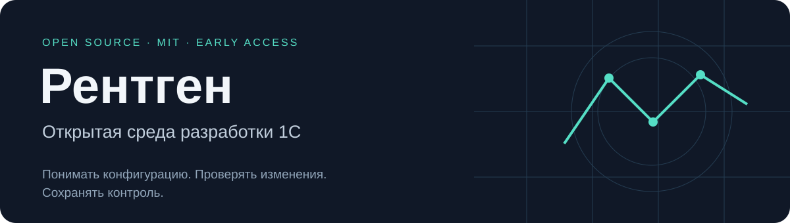
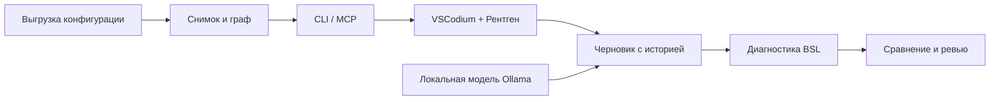

  
  
  

<a href="GETTING_STARTED.md"><b>Начать работу</b></a> · <a href="https://github.com/DmitrL-dev/1cai-public/releases">Скачать</a> · <a href="ROADMAP.md">План развития</a> · <a href="CONTRIBUTING.md">Участвовать</a>

Рентген помогает разрабатывать и разбирать конфигурации 1С: фиксирует исходники
в снимках, связывает код с графом зависимостей и сохраняет предложения агента
в отдельных черновиках с историей. Вы видите, что изменилось и что проверено.

**Полностью открытый собственный код под MIT.** Ядро, CLI, MCP, расширение
редактора и адаптер локальной модели доступны для самостоятельной сборки
и доработки. Обязательной подписки на сервис Рентгена нет. Платформа 1С,
модели и сторонние инструменты распространяются на своих условиях.

> **Ранний доступ — проверенные компоненты, продукт ещё развивается.**
> Текущий профиль: Windows x64, Python 3.11; core `0.1.0.dev8`, companion `0.1.8`.
> На 1С 8.3.27.2342 проверены синтетические сценарии компиляции и тестирования.
> Приёмка на типовых конфигурациях и применение изменений ещё впереди.

В dev8 доступны
[сравнение сохранённых снимков](docs/product/SNAPSHOT-DIFF.md) и
[локальный observer выгрузки](docs/product/OBSERVER.md): захват при изменении,
сохранённые отчёты и восстановление после сбоя без запросов к LLM.
Также доступна [проверка предложения компилятором 1С](docs/product/PROPOSAL-PLATFORM-CHECK.md)
на отдельной базе из сохранённой выгрузки.
Из редактора можно запустить [BSL-проверку](docs/product/EDITOR-BSL-CHECK.md),
проверку компилятором и [тесты сохранённой версии](docs/product/EDITOR-TESTS.md),
а затем восстановить отчёт без повторного запуска. Устанавливайте dev8
в отдельное окружение по инструкции ниже.

### Что можно сделать сейчас

| Сценарий | Что уже работает |
| :--- | :--- |
| Разобраться в проекте | Захват выгрузки, неизменяемые снимки, поиск модулей, чтение кода, граф и анализ влияния |
| Дать агенту контекст | Локальный stdio MCP; профиль редактора ограничивает проект и доступные инструменты |
| Подготовить правку | Отдельные черновики, версии, сравнение, проверка конфликтов при записи и квитанции операций |
| Работать в редакторе | Деревья модулей и черновиков в VSCodium, поиск, история и сравнение версий |
| Проверить предложение модели | Один запрос к локальной Ollama, диагностика BSL до и после, сохранённая ревизия и восстановление результата |
| Проверить сохранённую версию | BSL, компилятор 1С и доверенный профиль YAxUnit на отдельных базах; отчёты по конкретной ревизии |
| Следить за выгрузкой | Сравнение снимков и observer с сохранёнными отчётами без обращений к модели |

В ветке разработки после dev8 доступен [план и preview правки метаданных через EDT](docs/product/METADATA-PREVIEW.md):
переименование реквизита по сохранённому снимку, проверка UUID и два отдельных diff.
Также доступны отдельные библиотеки [подготовки apply](docs/product/METADATA-APPLY.md),
[квалификации metadata candidate](docs/product/METADATA-APPLY-GATE.md) и
[Git-находок](docs/product/GIT-FINDINGS.md): preconditions и lifecycle Git-находок
доступны через observer CLI, а metadata gate остаётся read-only. Ни один из этих
срезов не выполняет запись в рабочее дерево; живое применение и отмена в разработке.

Исходная конфигурация не меняется при создании черновика. Отсутствие ошибок BSL
не подтверждает правильность бизнес-логики и не разрешает применение.

### Как устроен Рентген

Источник истины — локальное ядро. Модель предлагает текст; адаптер и ядро
проверяют структуру операций, права и ожидаемую ревизию. Восстановление по
квитанции не повторяет запрос модели или запись.

### Начать с проверенного сценария

1. Установите [офлайн-комплект ядра](GETTING_STARTED.md) в отдельное окружение.
2. Зарегистрируйте папку выгрузки и создайте первый снимок.
3. Подключите [профиль VSCodium / Cline](integrations/open-editor/README.md).
4. Откройте модуль, сохраните черновик и проверьте сравнение.

Для просмотра модель не нужна. Для управляемой локальной правки нужны Ollama
с установленной моделью и закреплённый runtime BSL. Проверен один искусственный
сценарий на Qwen3.5:9b; это не оценка качества на произвольных задачах 1С.

### Куда движемся

Приоритет — проверяемая ежедневная разработка 1С: от понимания конфигурации
до безопасного обновления с сохранением доработок. Затем — постоянный аудит
и отчёты о состоянии продукта для владельца.

| Следующий этап | Критерий готовности |
| :--- | :--- |
| Ежедневная AI-разработка | Репрезентативные задачи, предсказуемые затраты, проверки и удобное ревью |
| Работа с объектами без GUI Конфигуратора | Явная матрица поддерживаемых объектов и проверка результатов платформой |
| Обновление конфигураций | Сохранение доработок, объяснимые конфликты, тестовый прогон и восстановление |
| Непрерывный аудит | Анализ новых снимков без лишних запросов модели, отчёты с источниками метрик |
| Защита через Spectorn | Проверенный маршрут к upstream, поведение при отказе и подтверждение защиты |

Эти возможности **не объявлены готовыми**. Spectorn пока не подключён
к управляемому адаптеру правки. Подробности и порядок — в [плане развития](ROADMAP.md).

### Документация и исходники

| Раздел | Содержание |
| :--- | :--- |
| [Установка](GETTING_STARTED.md) | Готовые файлы, контрольные суммы, первый проект |
| [Ядро и MCP](docs/product/CORE-MCP.md) | Контракты, права, ограничения и восстановление |
| [Расширение](integrations/vscode-rentgen/README.md) | Просмотр, черновики и локальная правка |
| [Архитектура](ARCHITECTURE.md) | Границы модулей и источник истины |
| [Готовность](docs/product/READINESS.md) | Что проверено и что ещё предстоит |
| [Разработка](CONTRIBUTING.md) | Сборка, тесты и правила изменений |

Текущий публичный состав заменяет прежнее экспериментальное дерево.
Старые портал, демо и интеграции доступны в
[истории до обновления](https://github.com/DmitrL-dev/1cai-public/tree/c4f633d9edb8a2a15c66358adc2e01835820d947).
Их прежние заявления о готовности не относятся к текущей поставке.
