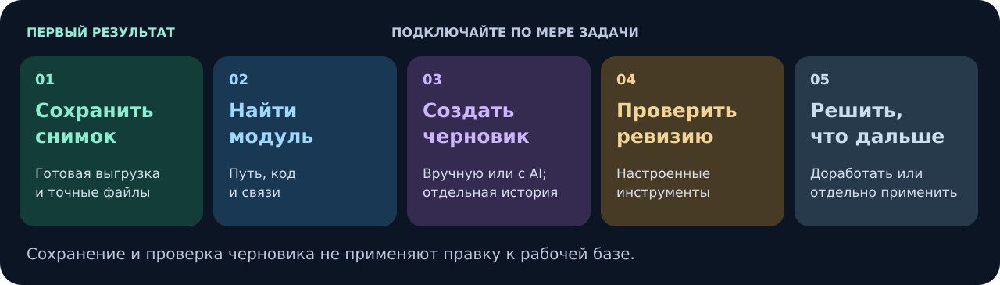

<picture>
  <source media="(max-width: 600px)" srcset="docs/assets/hero-narrow.svg">
  
</picture>

  <a href="https://dmitrl-dev.github.io/1cai-public/"><b>Сайт проекта</b></a> ·
  <a href="GETTING_STARTED.md"><b>Попробовать на своём проекте</b></a> ·
  <a href="docs/START_HERE.md">Как это работает</a> ·
  <a href="https://github.com/DmitrL-dev/1cai-public/releases">Скачать</a> ·
  <a href="ROADMAP.md">Куда движемся</a>

# Рентген — от кода 1С к проверяемой правке

Разберитесь в исходниках конфигурации. Подготовьте изменение отдельным
черновиком. Сравните версии и прочитайте результаты проверок перед решением
о применении.

**Первый результат — снимок проекта и список его модулей.** Если папка выгрузки
уже есть, для этого не нужны AI, редактор или установленная платформа 1С.
Работу ведёт локальное ядро; остальные инструменты добавляются по мере задачи.

> **Ранний доступ · MIT · Windows x64 / CPython 3.11**
>
> Опубликованы [Core dev17](https://github.com/DmitrL-dev/1cai-public/releases/tag/core-v0.1.0-dev17)
> и [Companion 0.1.18](https://github.com/DmitrL-dev/1cai-public/releases/tag/companion-v0.1.18).
> Отдельно опубликовано экспериментальное дополнение Linux x86_64.
> Проверены ограниченные сценарии. Полная ежедневная работа, произвольные
> конфигурации и качество AI ещё требуют приёмки.
> [Версии, проверки и ограничения →](docs/product/READINESS.md)

## Одна задача. Видимый путь до решения.

<picture>
  <source media="(max-width: 600px)" srcset="docs/assets/product-flow-narrow.svg">
  
</picture>

1. **[Сохраните исходное состояние](GETTING_STARTED.md#3-сохраните-первый-снимок).** Снимок связывает точные файлы и граф проекта.
2. **[Найдите нужный модуль](docs/USER_GUIDE.md#найти-и-прочитать-модуль).** Читайте сохранённую версию, изучайте связи и сравнивайте изменения.
3. **[Подготовьте черновик](GETTING_STARTED.md#5-подготовьте-первый-черновик-и-проверки).** Вручную или с моделью. У предложения своя история и ревизии.
4. **[Проверьте выбранную ревизию](docs/USER_GUIDE.md#проверить-выбранную-версию).** Diff, BSL, компилятор и тесты дают разные результаты и требуют своей настройки.
5. **[Решите, что дальше](docs/USER_GUIDE.md#решить-применять-ли-изменение).** Доработать, оставить в истории или отдельно применить поддержанную правку.

Сохранение черновика и успешная проверка не изменяют рабочую базу.
После правки нужна проверка новой ревизии. Применение к выгрузке и обновление
информационной базы 1С — самостоятельные операции со своими условиями.

## Начните с малого

Для первого запуска подготовьте **Windows x64, CPython 3.11 и копию небольшой
папки выгрузки**. В опубликованный комплект входит scanner; модели в нём нет.

| Шаг | Что сделать | Что получите |
| :--- | :--- | :--- |
| **01 · Установить** | [Скачать Core dev17 и проверить комплект](GETTING_STARTED.md#готовый-core-dev17) | Отдельное окружение ядра |
| **02 · Подключить** | [Зарегистрировать свою папку выгрузки](GETTING_STARTED.md#2-зарегистрируйте-проект) | Проект с локальным состоянием |
| **03 · Увидеть** | [Сохранить снимок и вывести модули](GETTING_STARTED.md#3-сохраните-первый-снимок) | Первый полезный результат |

**[Открыть пошаговый первый запуск →](GETTING_STARTED.md)**
Команды, ожидаемые ответы и [помощь при ошибке](GETTING_STARTED.md#если-что-то-не-получилось)
собраны в одной инструкции.

После этого можно [подключить Companion](GETTING_STARTED.md#4-откройте-модуль-в-редакторе)
для просмотра и черновиков. Для AI, BSL, проверки 1С и YAxUnit есть отдельные
[требования](docs/START_HERE.md#что-подготовить). Они не нужны все сразу.

## Что вы контролируете

| Ваш вопрос | Ответ Рентгена |
| :--- | :--- |
| **Какой код я вижу?** | Выбранный сохранённый снимок, пути и идентификаторы файлов |
| **Что предлагается изменить?** | Отдельный черновик, сравнение и история его версий |
| **Что именно проверено?** | Результат инструмента для конкретной сохранённой ревизии |
| **Что произошло после прерывания?** | Сохранённые квитанции и результаты; неизвестный исход требует разбора |
| **Кто разрешает запись?** | Права проекта, условия выбранной операции и отдельное решение о применении |

Отчёт модели не даёт права на запись. BSL-диагностика, компиляция и тесты
не доказывают всю бизнес-логику. Рентген не заменяет резервные копии базы
и проверку специалистом по 1С.

[Все возможности и их границы →](docs/CAPABILITIES.md)

## Быстрее к результату. Меньше привязок.

Ближайший курс — понятный старт, переносимое ядро и скорость по измерениям.

- **Сначала переносимые операции.** Локальное состояние и чтение истории,
  затем безопасное чтение снимков и остальные адаптеры.
- **Редактор и модель по выбору.** Базовый результат не должен ждать сложного
  AI-окружения. Текущий профиль Companion пока требует Windows.
- **Rust по проверяемым частям.** Экспериментальный Linux input core уже
  принимает ограниченные ZIP-выгрузки; время и память измеряются отдельно.
  Универсальное ускорение и полная перепись не заявлены.

**Linux и macOS — цели поэтапной разработки.** Полный продукт на них ещё
не принят. Windows live apply и native-инструменты остаются отдельными
возможностями со своей квалификацией.

[План с критериями завершения](ROADMAP.md) ·
[Поддержка платформ](docs/product/PLATFORM-SUPPORT.md) · [Архитектура](ARCHITECTURE.md) ·
[Linux CLI/state](docs/product/PORTABLE-CORE.md) · [Rust ZIP import](docs/product/RUST-INPUT-CORE.md) ·
[Source-facts CLI: приёмка pending](docs/product/SOURCE-FACTS.md)

## Выпуск, исходники и эксперименты

| Уровень | Что это значит |
| :--- | :--- |
| **Опубликованная пара** | Core dev17 / Companion 0.1.18. Последняя подтверждённая на 5 октября 2026; устанавливайте по инструкции её версии |
| **Текущие исходники** | Core dev18 / Companion 0.1.19 в метаданных. Дополнительные изменения проходят приёмку; checkout не обновляет выпущенные пакеты |
| **Эксперимент Linux** | Дополнение Core dev17: локальное состояние/история и ограниченный Rust ZIP import. Без capture, live apply, native 1С и Companion; полный продукт на Linux не принят |
| **Следующие этапы** | Переносимость и оптимизация принимаются по операциям и ОС, без обещания одинаковых возможностей уже сейчас |
| **Editor / Main witness** | Ограниченные [эксперименты](scripts/verification/main_witness_receiver/README.md); не доказательство готовности ежедневной AI-разработки |

Исторические native-проверки относятся к своим версиям и синтетическим
сценариям. Тесты на реальных клиентских базах и полная совместимость типовых
конфигураций ими не подтверждены. [Матрица совместимости →](docs/product/CONFIGURATION-COMPATIBILITY.md)

## Найти нужное

[Первое знакомство](docs/START_HERE.md) ·
[Как пользоваться](docs/USER_GUIDE.md) ·
[Каталог документации](docs/README.md) ·
[Установка из исходников](docs/product/CORE-INSTALLATION.md) ·
[MCP](docs/product/CORE-MCP.md) ·
[Участие в разработке](CONTRIBUTING.md) ·
[Сообщить о проблеме](https://github.com/DmitrL-dev/1cai-public/issues)

Собственный код открыт под [MIT](LICENSE). Обязательной подписки на сервис
Рентгена нет. Лицензии и условия 1С, редактора, моделей и зависимостей действуют
отдельно.

Исторические портал, демо и интеграции

Сохранены в [истории репозитория](https://github.com/DmitrL-dev/1cai-public/tree/c4f633d9edb8a2a15c66358adc2e01835820d947).
Их прежние заявления о готовности не относятся к текущей поставке.

