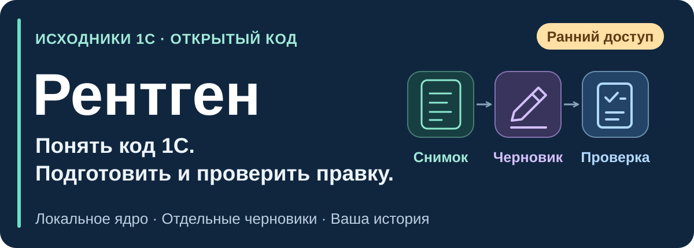
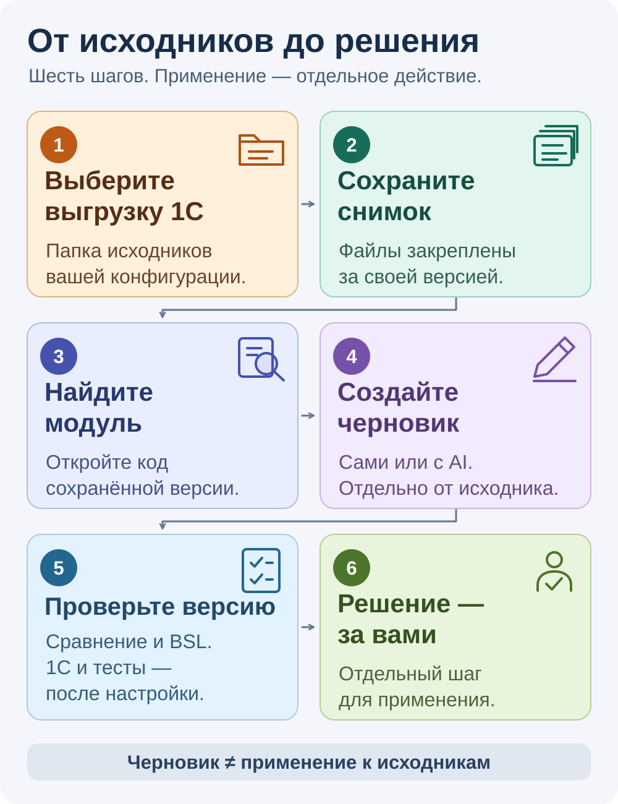

<a href="docs/START_HERE.md"><b>Начать знакомство</b></a> · <a href="GETTING_STARTED.md"><b>Первый запуск</b></a> · <a href="docs/USER_GUIDE.md">Как пользоваться</a> · <a href="docs/README.md">Все инструкции</a> · <a href="https://github.com/DmitrL-dev/1cai-public/releases">Скачать выпуск</a>

# Рентген — понятный путь от кода 1С к проверяемой правке

Рентген помогает **разобраться в исходниках конфигурации 1С, подготовить
изменение и проверить его перед решением о применении**. Вы указываете папку
с исходниками, сохраняете её версию и находите нужный модуль. Предложение
правки хранится отдельным черновиком: его можно сравнить, доработать и проверить.

Работу ведёт локальное ядро; для просмотра и редактирования есть расширение
редактора. Языковую модель (AI) можно подключить на этапе подготовки правки.

> **Ранний доступ.** Реализованы отдельные маршруты и проверены ограниченные
> сценарии. Полная готовность к ежедневной работе, типовые конфигурации
> и качество AI на произвольных задачах ещё не приняты.
> [Что подтверждено и какой выпуск опубликован →](docs/product/READINESS.md)

## Выберите свой маршрут

**Впервые увидели Рентген**

Начните здесь: [Путеводитель для первого знакомства](docs/START_HERE.md).

Что получите: понятную картину работы, список подготовки и объяснение терминов.

**Разработчик 1С и хотите попробовать**

Начните здесь: [Первый запуск](GETTING_STARTED.md).

Что получите: снимок своей выгрузки и список модулей.

**Уже открыли проект в редакторе**

Начните здесь: [Как пользоваться](docs/USER_GUIDE.md).

Что получите: порядок работы с модулями, черновиками и проверками.

**Оцениваете инструмент для команды**

Начните здесь: [Возможности и ограничения](docs/CAPABILITIES.md).

Что получите: реализованные маршруты, условия и ссылки на подтверждения.

**Настраиваете или развиваете интеграцию**

Начните здесь: [Каталог документации](docs/README.md#настроить-окружение-и-доступ).

Что получите: установку Core, профиль редактора, MCP и права проекта.

Подготовить выгрузку и оценить смысл изменения поможет специалист по 1С.
Для чтения документации достаточно начать с путеводителя.

## Как устроена работа

<picture>
  <source media="(max-width: 600px)" srcset="docs/assets/how-rentgen-works-narrow.svg">
  
</picture>

[Вертикальная схема с крупными подписями →](docs/assets/how-rentgen-works-narrow.svg) ·
[Широкая схема →](docs/assets/how-rentgen-works.svg)

1. **Выгрузка** — папка исходных файлов вашей конфигурации 1С.
2. **Снимок** — сохранённая версия этих файлов для чтения и сравнения.
3. **Модуль** — выбранный файл кода из снимка, открытый для просмотра.
4. **Черновик** — отдельное предложение изменения, подготовленное вами или AI.
5. **Проверки** — сравнение и результаты настроенных инструментов для этой ревизии.
6. **Решение** — доработать, оставить предложение в истории или отдельно применить поддержанную правку.

Первый ручной черновик создаётся командами ядра; редактор позволяет
доработать уже сохранённый. [Как создать первый черновик →](GETTING_STARTED.md#5-подготовьте-первый-черновик-и-проверки)

После изменения черновика проверяйте новую ревизию.
Результат прежней проверки относится к прежнему тексту.

## Что уже можно делать

| Задача | Как это устроено |
| :--- | :--- |
| Читать сохранённый код | Создать снимок, искать модули по части пути и открывать их в редакторе |
| Готовить и сравнивать предложения | Хранить черновики отдельно, смотреть отличия и историю, сохранять ручные исправления новой ревизией |
| Получать результаты проверок | После настройки запускать BSL-диагностику, проверку платформой 1С или тесты YAxUnit для выбранной версии |
| Возвращаться после прерывания | Читать сохранённый результат операции через команды редактора или ядра |

Модель подключается отдельно. Для анализа связей, сравнения снимков,
наблюдения за проектом и отчётов владельца есть дополнительные маршруты,
описанные в [подробном обзоре](docs/CAPABILITIES.md).

## Первый результат — снимок и список модулей

Для этого шага **AI и установленная платформа 1С не нужны**, если готовая
папка выгрузки уже есть.

1. [Установите Core](GETTING_STARTED.md#1-установите-ядро) в отдельное окружение.
2. [Зарегистрируйте свою выгрузку](GETTING_STARTED.md#2-зарегистрируйте-проект).
3. [Создайте снимок и получите список модулей](GETTING_STARTED.md#3-сохраните-первый-снимок).
4. Когда этот результат получен, [подключите редактор](GETTING_STARTED.md#4-откройте-модуль-в-редакторе).

В инструкции есть команды и признаки успеха каждого шага.
Начните с копии небольшого проекта.

Если шаг не дал ожидаемого результата, откройте
[«Если что-то не получилось»](GETTING_STARTED.md#если-что-то-не-получилось).

| Уровень знакомства | Что подготовить |
| :--- | :--- |
| Снимок и список модулей | Windows x64, CPython 3.11, Core со scanner, папку выгрузки |
| Просмотр и черновики в редакторе | Отдельный профиль VSCodium / Cline с Companion, доступ к проекту и доверие к рабочей папке |
| Локальная AI-правка и BSL | Ollama с загруженной моделью, закреплённые Java и BSL Language Server |
| Проверка 1С и тесты | Установленную платформу, место для отдельных баз; для YAxUnit — доверенный тестовый профиль |

[Что означают эти названия и что понадобится именно вам →](docs/START_HERE.md#что-подготовить)

## Версии и условия применения

| Состав | Статус |
| :--- | :--- |
| [Core dev15](https://github.com/DmitrL-dev/1cai-public/releases/tag/core-v0.1.0-dev15) / [Companion 0.1.15](https://github.com/DmitrL-dev/1cai-public/releases/tag/companion-v0.1.15) | Последняя опубликованная пара раннего доступа |
| Core dev16 / Companion 0.1.17 | Кандидаты в текущих исходниках; общая квалификация и выпуск ещё не завершены |

**Сохранение черновика и успешная проверка не применяют правку.** Применение
к исходным файлам требует отдельной операции и поддержано в ограниченных
сценариях. Обновление информационной базы 1С имеет свои требования.
BSL-диагностика и компиляция проверяют свой набор условий;
смысл бизнес-изменения должен оценить человек.

[Границы применения](docs/CAPABILITIES.md#применение-правок) ·
[Совместимость конфигураций](docs/product/CONFIGURATION-COMPATIBILITY.md) ·
[Состояние поставки](docs/product/READINESS.md) · [План развития](ROADMAP.md)

---

Собственный код открыт под [MIT](LICENSE). Обязательной подписки на сервис
Рентгена нет; лицензии и условия 1С, моделей и сторонних инструментов действуют
отдельно. [Ответы на вопросы новичка](docs/START_HERE.md#ответы-на-первые-вопросы) ·
[Правила участия](CONTRIBUTING.md) · [Сообщить о проблеме](https://github.com/DmitrL-dev/1cai-public/issues)

[Исторические портал, демо и интеграции](https://github.com/DmitrL-dev/1cai-public/tree/c4f633d9edb8a2a15c66358adc2e01835820d947)
сохранены в истории; их прежние заявления о готовности не относятся к текущей поставке.
