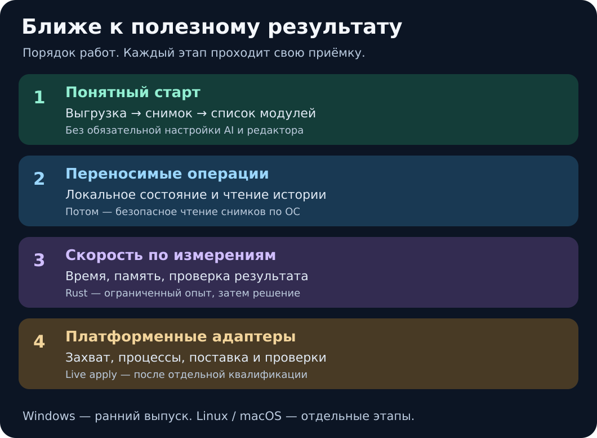

# План развития Рентгена

**Курс: привычная IDE для ежедневной разработки 1С, самостоятельно и в
команде, с AI или без него.** Первые приоритеты: подключение проекта и хранилища,
поиск метаданных и надёжная отладка. Целевой кодовый цикл проходит без возврата
в окно Конфигуратора через квалифицированные штатные backend 1С.

[Следующее поколение Рентгена](docs/product/IDE-DEVELOPMENT-PLAN.md) содержит
первые дизайн-макеты, 24 сценария, публичные источники и критерии приёмки.
Это план, новая IDE ещё не выпущена. Даты и одинаковые возможности всех ОС
не обещаются. Нынешний первый маршрут и принятые пакеты сохраняют свои границы.

Это порядок работ и критерии их завершения, а не список выпущенных функций.
[Состояние поставки](docs/product/READINESS.md) и
[поддержка платформ](docs/product/PLATFORM-SUPPORT.md) отделяют опубликованный
выпуск, проверяемые исходники и будущие возможности. Собственный код остаётся
открытым под MIT; модель и редактор подключаются по необходимости.

## Направления следующего поколения

Подробности и единая матрица находятся в
[плане IDE](docs/product/IDE-DEVELOPMENT-PLAN.md); ниже только порядок работ.

1. **AI competence pilot.** Сравнить готовую архитектуру, собственный Rust-компонент
   и гибрид на одинаковых фактах. Новая независимая проверка качества,
   включая известные причины, before/after, baselines и недостаточные данные.
2. **Знакомая оболочка.** Spike Theia и развитие Companion как кандидаты;
   дерево, editor, search, diff и checks. Выбор архитектуры ещё открыт.
3. **Контекст проекта.** Разделить source revision, собранный artifact и применённую
   конфигурацию БД. Индекс метаданных/BSL и lossless adapters форматов.
4. **Native-цикл.** Квалифицировать Designer batch/AgentMode, EDT CLI и готовые
   LSP/DAP; проверить storage/search/debug в законченном пользовательском сценарии.
5. **Команда.** Worktrees, задачи и review, отдельные права и проверка ревизии
   перед записью. Ручная работа сохраняется при выключенных агентах.
6. **Расширение покрытия.** Формы, запросы, СКД, расширения, merge/update,
   полноценный build/test/deploy и recovery после собственных проверок.

Первый check/build/run нужен уже для приёмки storage/search/debug. Широкая
матрица сборки, тестирования и deployment развивается следующим этапом.
Три сквозных результата: проверенная правка в dev-базе, воспроизводимая отладка,
согласованная версия после конфликта двух разработчиков. Существующие
направления ниже дают техническую основу и продолжаются в своих границах.

## 1. Понятный первый результат

Сохранить короткий маршрут опубликованного Windows-выпуска:
«папка выгрузки → снимок → список модулей». Он не требует AI, редактора или
установленной 1С, если исходники уже подготовлены. Дальше пользователь отдельно
выбирает черновик, проверки и применение.

Что меняем:

- Один вход в документацию, явные требования и пример результата каждого шага.
- Раздельные статусы «есть в выпуске», «проверяется в исходниках» и «планируется».
- Понятное объяснение недоступной операции: чего не хватает и что доступно сейчас.
- Редактор и модель остаются дополнительными клиентами ядра; их подготовка
  не становится обязательной для первого результата.

Готово, когда новый пользователь проходит инструкцию из чистого окружения,
получает ожидаемый результат и может восстановиться после прерывания по той же
инструкции. Время до первого результата измеряется на описанном проекте;
цифры появятся после измерений.

## 2. Узкое рассуждение о 1С: первый синтетический компонент

Отдельный [Rust diagnostic kernel](docs/product/DIAGNOSTIC-KERNEL.md) уже проходит
ограниченный synthetic gate. Это typed-evidence компонент без пользовательского
CLI/MCP и native probes; известные потери покрытия явно сохранены. Далее:

Развивать специализированную диагностику: набор гипотез → минимальная
различающая проверка → типизированное наблюдение → пересмотр вывода или явный
недостаток данных. Начать с недоступности метода в контексте вызова, отсутствия
члена у непосредственного получателя и рассогласования исходников/runtime.
Причины различаются доказательствами, а не формулировкой исключения.

Уже имеющийся небольшой детерминированный Rust kernel и обратимый synthetic
fact loop остаются отдельным компонентным экспериментом. Для выбора AI-архитектуры
нужен новый независимый benchmark из плана IDE; старый gate его не заменяет.
Полезность сравнивается с простыми baselines на одинаковых входах. Native probes допускаются позже,
после проверки сигнатур и контекстов в изолированной 1С. Python сохраняет
orchestration/права, существующий Rust ZIP reader и Go scanner — свои роли.

Готово для следующего этапа, когда показаны полезный выбор проверки, пересмотр
после изменения фактов, корректное `insufficient_data` и отсутствие утечек на
зафиксированном наборе тестов. Это ещё не production/native-приёмка, готовый AI
или разрешение на применение. [План, протокол и критерии](docs/product/NARROW-DIAGNOSTICS-PLAN.md).

## 3. Переносимое ядро небольшими этапами

Целевые ОС — Windows, Linux и macOS. **Они не объявлены равно поддержанными.**
Опубликованный комплект рассчитан на Windows x64 / CPython 3.11. Наличие
Python wheel или переносимого Go scanner не подтверждает весь продукт на другой ОС.

### Сначала: локальное состояние и чтение истории

В экспериментальном Linux-дополнении dev17 уже опубликованы local identity
profile, project/state reads, draft history/receipt и byte/JSON planners. Подробный
контракт и ограничения — [PORTABLE-CORE](docs/product/PORTABLE-CORE.md). Это не
приёмка всех команд Linux и не автоматический импорт Windows identity/state.

Первый ограниченный этап — доверенная локальная идентичность, список проектов,
состояние проекта, чтение существующей истории/квитанций черновиков и явный
отчёт о доступных операциях. Затем — подходящие операции планирования по
переданным данным. Перенос существующего Windows-состояния между машинами
нуждается в отдельном контракте; совпадение имени пользователя или UID не даёт доступа.

Готово, когда настоящие CLI/MCP-процессы выполняют заявленный сценарий на
каждой целевой ОС без подмены идентичности в тестах. Недоступные операции
отказывают до побочных эффектов. Linux-проверка не заменяет Windows или macOS.
Первый этап не обещает чтение любого снимка, создание новых черновиков или live apply.

### Затем: чтение сохранённых снимков

Отделить интерфейс безопасного чтения от Windows-реализации. Для Linux и macOS
принимать отдельные адаптеры чтения принадлежащих хранилищу снимков: ограничения
размера, контроль байтов и хэшей, удержание сессии, обработка ссылок, подмен путей,
особых файлов и конкурентных изменений.

Готово, когда условия каждого адаптера проверены на своей ОС. Открытый POSIX
дескриптор не обещает Windows-запрет чужой записи/удаления. Если нужная гарантия
не обеспечена, операция остаётся недоступной или получает явно более узкий режим.

### После этого: захват, процессы и поставка

Переносить захват снимков, публикацию, запуск анализаторов, отмену и очистку
процессов по отдельности. Для каждой ОС нужны установка/обновление, ограниченные
ресурсы, прерывание, потеря ответа и повторный запуск. Платформенные инструменты
1С, EDT и службы подключаются отдельными адаптерами.

Применение к живым исходникам переносится последним. Доступная операция не
заменяет права проекта, проверку версии и отдельное решение о записи.

## 4. Скорость по измерениям

Сначала измерить холодный и повторный запуск, захват и хэширование, построение
графа, чтение модуля, историю черновика и пиковую память. Указать ОС, оборудование,
версию, размер проекта и повторения. Модель, внешние анализаторы и 1С измерять
отдельно от ядра.

Ускорять подтверждённое узкое место. Повторно использовать результаты только
при совпадении проверенных входов; не ослаблять проверки целостности и доступа.
Критерий завершения — воспроизводимое сравнение до/после без регрессий
в результате, памяти, отмене и восстановлении. Процент ускорения пока не заявлен.

**Первый Rust-срез реализован:** [ограниченный Linux ZIP import](docs/product/RUST-INPUT-CORE.md)
с owned process/immutable bytes, без извлечения файлов на диск и без live apply.
Есть adversarial/parity/lifecycle тесты и synthetic latency/RSS observations;
они не доказывают универсальное ускорение. Для опубликованного dev17 приняты
целевые CI и установка экспериментального дополнения. Далее — новые read-only
adapters с отдельной Windows/macOS квалификацией. Python orchestration
и отдельный Go scanner пока сохраняются.

## 5. Надёжный выпуск и проверяемая правка

В Core dev17 приняты компонентные проверки восстановления после прерывания и
потери ответа, сохранения сторонних изменений, миграции SQLite с WAL и описаний
операций MCP. Следующие пакеты требуют повторной квалификации точных bytes.
Изменения исходников и локальные тесты относятся к выбранному candidate;
они не обновляют опубликованные пакеты dev17.

Для выбранного commit нужны актуальные CI, установка готовых артефактов,
проверка совместимости Core/Companion и повторение заявленных Windows-сценариев.
Результат старого CI не переносится на новую сборку.

После этого расширять набор реальных задач «найти → предложить → проверить →
принять». Измерять время, ресурсы и расход модели; проверять повторный запуск,
отмену, восстановление отчёта и ручное ревью. Опыты Editor/Main witness остаются
[экспериментами с ограниченной областью](scripts/verification/main_witness_receiver/README.md),
пока не пройден весь заявленный пользовательский сценарий.

## 6. Метаданные и обновления конфигураций

Расширять операции по явной матрице объектов и форматов. Уже существующие
[BSL](docs/product/PROPOSAL-LIVE-APPLY.md) и
[Designer XML](docs/product/METADATA-LIVE-APPLY.md) writers ограничены своими
сценариями; исторические native-опыты не подтверждают новый пакет.

Для обновлений развивать [three-way план](docs/product/THREE-WAY-UPDATES.md),
[Designer XML по UUID](docs/product/METADATA-THREE-WAY.md) и
[EDT identity](docs/product/EDT-IDENTITY-THREE-WAY.md). План и кандидат в памяти
не равны применённому обновлению. Неоднозначные изменения должны давать конфликт.

Готово, когда проверены сохранение доработок и данных, загрузка в реальную 1С,
бизнес-тесты, резервирование и возврат на репрезентативных конфигурациях.
Синтетические примеры не заменяют эту [матрицу совместимости](docs/product/CONFIGURATION-COMPATIBILITY.md).
Полная замена Конфигуратора и произвольные обновления `.cf/.cfe` пока не обещаются.

## 7. Аудит и дополнительные интеграции

Развивать [Git watcher](docs/product/GIT-WATCHER.md), отчёты и анализаторы
после устойчивого базового маршрута. Анализировать изменившиеся входы без LLM
на каждом опросе. Отчёт владельца должен показывать источник, дату и пробелы:
деньги, простои и эффективность нельзя достоверно вывести из одного кода.

Spectorn остаётся отдельной возможной интеграцией. Текущий управляемый адаптер
обращается к локальной Ollama напрямую. Защищённый upstream-маршрут требует
своей приёмки и не блокирует работу ядра без модели.

## Когда этап становится обещанием продукта

Для каждой возможности публикуются версия, ОС, предусловия, ограниченный
сценарий, результат проверки и известные ограничения. Прошедшая сборка,
перечень тестов или один искусственный опыт не объявляют готовность всего продукта.
Сначала принимаются точные артефакты, затем публикуются новый тег и notes;
старые байты и исторические доказательства сохраняются.

[Правила выпуска](scripts/release/README.md) ·
[Архитектура](ARCHITECTURE.md) · [Как участвовать](CONTRIBUTING.md)
