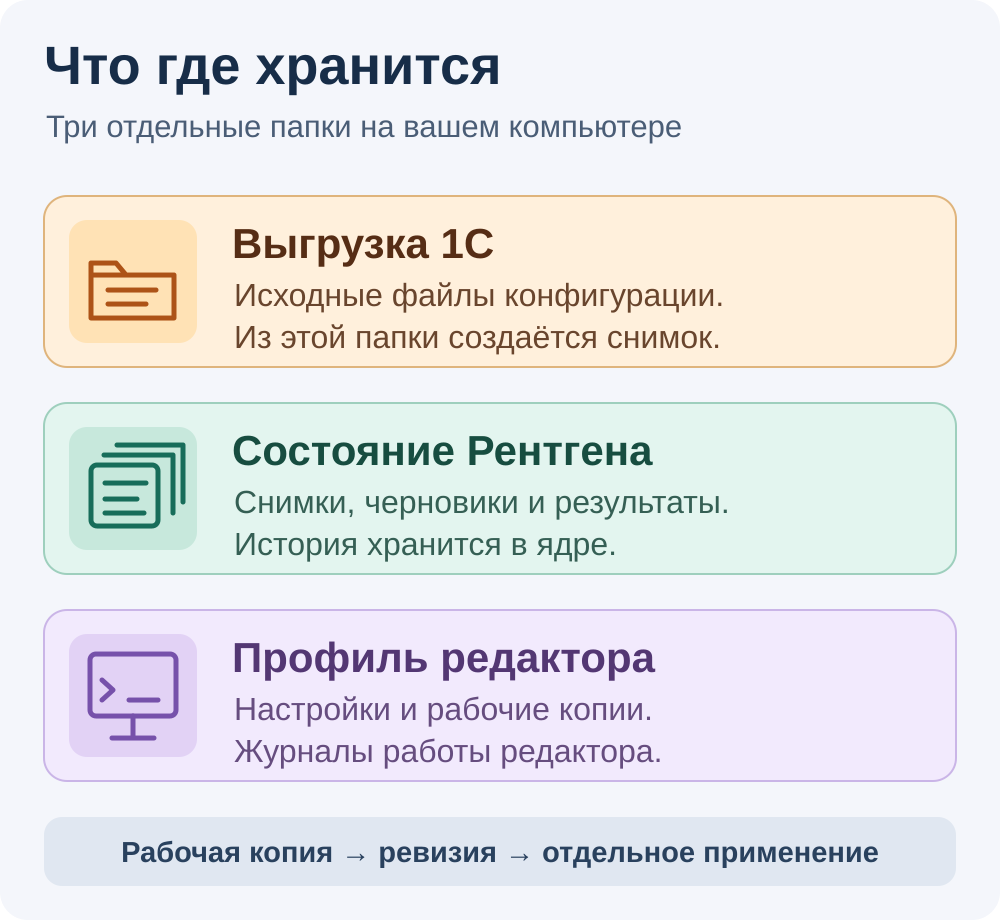

# Первое знакомство с Рентгеном

[Главная](../README.md) · [Первый запуск](../GETTING_STARTED.md) · [Как пользоваться](USER_GUIDE.md) · [Все инструкции](README.md)

Рентген помогает работать с **исходниками конфигурации 1С**: сохранить их
версию, найти код, подготовить предложение изменения и прочитать результаты
проверок. Если вы впервые встретили названия Core, Companion и MCP,
начните с этой страницы.

## Как выглядит один законченный маршрут

**Папка исходников → снимок → модуль → черновик → проверки → ваше решение.**

Представьте небольшую задачу: нужно изменить поведение одного известного модуля.
Вы сохраняете исходное состояние, читаете модуль и готовите отдельное
предложение. Затем смотрите изменённые строки и проверяете выбранную версию.
Если нашли проблему, сохраняете исправление новой ревизией и проверяете её.

Получить первый снимок и список модулей можно раньше: модель,
редактор и установленная платформа 1С на этом этапе не нужны,
если папка выгрузки уже подготовлена.

[Открыть большую схему →](assets/how-rentgen-works.svg)

## Выберите ближайшую задачу

| Ваша ситуация | Следующее действие | Результат |
| :--- | :--- | :--- |
| Знакомитесь с инструментом | Прочитайте эту страницу и [ограничения](CAPABILITIES.md) | Понимаете, подходит ли маршрут вашей задаче |
| Разрабатываете на 1С и хотите попробовать | Выполните [первые три шага установки](../GETTING_STARTED.md) на копии небольшой выгрузки | Снимок и пути своих модулей |
| Разбираетесь в чужой конфигурации | После установки откройте [модули снимка](USER_GUIDE.md#найти-и-прочитать-модуль) | Читаете сохранённый код выбранной версии |
| Уже готовите изменение | Прочитайте [работу с черновиками](USER_GUIDE.md#исправить-сохранённый-черновик) и [проверки](USER_GUIDE.md#проверить-выбранную-версию) | Сохраняете версии предложения и читаете относящиеся к ним результаты |
| Руководите командой или владеете проектом | Начните с [состояния поставки](product/READINESS.md) и [совместимости](product/CONFIGURATION-COMPATIBILITY.md) | Оцениваете подтверждения и условия пилотного использования |
| Настраиваете рабочее место | Выберите инструкции в [разделе окружения и доступа](README.md#настроить-окружение-и-доступ) | Подготавливаете Core, редактор и права под выбранный сценарий |

Для выгрузки, настройки платформенных проверок и оценки правильности изменения
нужен специалист по 1С. Отчёты владельца тоже требуют подготовки источников
показателей; их условия описаны в [каталоге инструкций](README.md#наблюдать-за-проектом-и-получать-отчёты).

## Что подготовить

Подготовка добавляется по мере выбора задач.

| Что хотите получить | Что потребуется | Куда идти |
| :--- | :--- | :--- |
| Снимок и список модулей | Windows x64; CPython 3.11; Core со scanner; готовая папка выгрузки | [Установка и первый проект](../GETTING_STARTED.md#перед-началом) |
| Просмотр и ручная доработка черновиков в редакторе | Отдельный профиль VSCodium / Cline с Companion; доступ к проекту; доверенная рабочая папка | [Подготовка редактора](../GETTING_STARTED.md#4-откройте-модуль-в-редакторе) |
| Предложение локальной модели | Ollama с заранее загруженной моделью; закреплённые Java и BSL Language Server | [Правка с моделью](USER_GUIDE.md#подготовить-правку-с-моделью) |
| Проверка платформой и тесты | Установленная 1С; место для отдельных баз; для YAxUnit — зарегистрированный доверенный профиль | [Проверка версии](USER_GUIDE.md#проверить-выбранную-версию) |

**Папка выгрузки** содержит XML и файлы модулей, например
`CommonModules\ИмяМодуля\Ext\Module.bsl`. Её готовят средствами разработки 1С.
Один файл `.cf` или `.dt` не заменяет такую папку в инструкции первого запуска.

## Первый запуск: три действия и признаки успеха

Точные команды находятся в [инструкции первого запуска](../GETTING_STARTED.md).
Делайте шаги по порядку и сверяйте результат.

| Шаг | Ваше действие | Что должно получиться |
| :--- | :--- | :--- |
| 1 | [Установить опубликованный Core](../GETTING_STARTED.md#1-установите-ядро) в отдельное окружение Python | Проверка зависимостей проходит, команды ядра показывают справку |
| 2 | [Зарегистрировать свою папку выгрузки](../GETTING_STARTED.md#2-зарегистрируйте-проект) | Ответ с `project_id` — идентификатором вашего проекта |
| 3 | [Создать снимок и запросить его модули](../GETTING_STARTED.md#3-сохраните-первый-снимок) | Ответ с `snapshot_id`, затем пути BSL-модулей |

**Пути своих модулей в ответе — первый законченный результат.**
Сохраните ID проекта и снимка: названия проекта недостаточно для команд.

Дальше [подключите редактор](../GETTING_STARTED.md#4-откройте-модуль-в-редакторе),
найдите один модуль и прочитайте его. С AI и платформенными проверками
знакомьтесь после этого шага.

## Какие файлы вы увидите

| Место | Что хранится | Пример пути из инструкции |
| :--- | :--- | :--- |
| Выгрузка | Исходные файлы конфигурации | `C:\MyConfiguration` |
| Состояние Рентгена | Реестр проектов, снимки, черновики, результаты операций | `C:\RentgenState` |
| Профиль редактора | Настройки, рабочие копии черновиков и журналы | Своя новая папка, выбранная при настройке профиля |

Это примеры, которые нужно заменить своими путями. Папки выбираются отдельно.
Для прямого применения одного BSL-файла выгрузка и состояние должны находиться
на одном томе; остальные условия указаны в [инструкции применения](product/PROPOSAL-LIVE-APPLY.md).

При ручной правке есть три самостоятельных действия:

1. **Ctrl+S** сохраняет текст рабочей копии в редакторе.
2. **«Рентген: сохранить версию черновика»** добавляет ревизию в историю ядра.
3. **Применение** выполняется отдельной поддержанной операцией с собственными условиями.

Первый ручной черновик создают через CLI — команды ядра
`proposal-create` и `draft-save`. Рабочая копия в редакторе предназначена
для доработки существующего черновика. Выбор первого маршрута описан
на [шаге 5 первого запуска](../GETTING_STARTED.md#5-подготовьте-первый-черновик-и-проверки).

Снимок, черновик и информационная база 1С — разные объекты.
История Рентгена не заменяет резервные копии базы.

## Небольшой словарь

| Слово | Значение |
| :--- | :--- |
| Снимок | Сохранённая версия исходных файлов; у неё свой ID |
| Черновик | Предложение изменения, связанное с исходным снимком |
| Ревизия | Одна сохранённая версия черновика; новое сохранение создаёт следующую |
| Core | Локальное ядро Рентгена: хранит состояние и проверяет доступ |
| Companion | Расширение редактора с панелями модулей и черновиков |
| Scanner | Отдельная программа для захвата файлов и построения графа связей |
| VSCodium | Редактор кода, для которого готовится отдельный профиль Рентгена |
| Cline | Расширение редактора с AI-агентом, который может вызывать инструменты ядра |
| Ollama | Программа для запуска заранее загруженной локальной языковой модели |
| MCP | Способ, которым AI-агент обращается к инструментам ядра |
| CLI | Запуск команд ядра из терминала; в инструкции используется PowerShell |
| BSL | Язык модулей 1С; BSL Language Server выдаёт замечания по коду |
| YAxUnit | Инструмент тестирования 1С; для запуска Рентгену нужен доверенный тестовый профиль |

Дополнительные названия, квитанции и действия объяснены в
[пользовательском руководстве](USER_GUIDE.md#шесть-слов-которые-понадобятся).

## Ответы на первые вопросы

**Нужна ли обязательная платная подписка на Рентген?**

Нет. Собственный код открыт под [MIT](../LICENSE).
Условия 1С, редактора, моделей и других инструментов действуют отдельно.

**Можно ли начать без AI?**

Да. Первый снимок и список модулей получаются без модели.
Дальше можно читать код и сохранять черновики; подготовка AI-правки — отдельный маршрут.

**Есть только рабочая база 1С. Как начать?**

Попросите специалиста подготовить папку выгрузки исходников.
В приведённых командах нужен путь к этой папке. Начните с её небольшой копии.

**Рентген автоматически изменит рабочую базу?**

Создание снимка, просмотр и сохранение черновика её не обновляют.
Применение к исходным файлам требует отдельной операции; обновление
информационной базы имеет свои требования. [Подробнее](CAPABILITIES.md#применение-правок).

**Успешная проверка означает, что правка правильная?**

Проверка сообщает о своём наборе условий. BSL-диагностика не подтверждает
всю бизнес-логику, компиляция не заменяет тесты, а тесты покрывают только
заложенные в профиль сценарии. Смысл изменения оценивает человек.

**Вся работа гарантированно проходит без сети?**

Ядро хранит состояние локально, а просмотр не вызывает модель. Для локальной
правки выбран Ollama на вашем компьютере. Редактор, Cline и другой выбранный
провайдер могут обращаться к сети; полной изоляции профиль не обещает.
Журналы могут содержать код и текст задания.

**Можно ли уже считать инструмент готовым для любой конфигурации 1С?**

Пока принят ранний выпуск и ограниченные сценарии. Полная готовность,
типовые конфигурации и произвольное качество AI не заявлены.
Проверяйте [совместимость](product/CONFIGURATION-COMPATIBILITY.md) и
[состояние поставки](product/READINESS.md) для выбранного маршрута.

---

Продолжите с [первого запуска](../GETTING_STARTED.md), затем откройте
[пользовательское руководство](USER_GUIDE.md). Точные контракты и дополнительные
сценарии собраны в [каталоге документации](README.md).
