# Интерактивная карта архитектуры

Интерактивная версия архитектурной схемы платформы 1C AI Stack.

> **💡 Для полной интерактивности** (перетаскивание мышкой, кликабельные элементы с переходами на документацию) используйте [HTML версию](./interactive-architecture.html).

## Mermaid диаграмма (интерактивная в GitHub)

```mermaid
graph TB
    subgraph Users["👥 Пользователи"]
        Developer["👨‍💻 1C Developers<br/>Use IDE and automation"]
        Operator["👔 Business Stakeholders<br/>Consume dashboards, reports"]
    end

    subgraph Core["🔵 Core Services"]
        API["🌐 Graph API<br/>FastAPI<br/>GraphQL, REST, MCP endpoints"]
        RestGateway["⚡ Realtime Gateway<br/>Starlette, WebSocket<br/>Realtime streaming, MCP sessions"]
        Auth["🔐 Auth and RBAC<br/>OAuth2, JWT<br/>Identity, service tokens"]
        AdminPortal["🛡️ Admin Portal<br/>React, FastAPI<br/>Security agent UI, audit management"]
    end

    subgraph EventDriven["📡 Event-Driven Architecture"]
        EventBus["🚀 Event Bus<br/>NATS<br/>Event-driven messaging, async processing"]
    end

    subgraph Workers["⚙️ Worker Tier"]
        EventWorkers["🔍 Analysis Workers<br/>Event-Driven (NATS)<br/>BSL code analysis, audits"]
        MLPipelines["🤖 ML Pipelines<br/>Prefect, PyTorch<br/>Training, evaluation, embeddings"]
        ITSScraper["📰 ITS Scraper<br/>Async Python<br/>Stateful ingestion pipeline"]
        Orchestrator["🎯 Task Orchestrator<br/>Bash, scripts<br/>Composite pipelines and CLI"]
        YAxUnit["🧪 YAxUnit Test Runner<br/>Python + 1C<br/>BSL unit testing framework"]
    end

    subgraph DataStores["💾 Data Stores"]
        Postgres[("🐘 PostgreSQL<br/>Aurora / RDS<br/>Relational data, audit, configs")]
        Neo4j[("🕸️ Neo4j<br/>Graph DB<br/>Code structure and dependencies")]
        Qdrant[("🔍 Qdrant<br/>Vector DB<br/>Embeddings for semantic search")]
        Redis[("⚡ Redis<br/>In-memory<br/>Cache, rate limit, queues")]
        Minio[("📦 MinIO<br/>Object Storage<br/>Datasets, models, documentation dumps")]
        ClickHouse[("📊 ClickHouse<br/>Column Store<br/>Observability long term metrics")]
    end

    subgraph Integrations["🔗 Integration Channels"]
        EDTPlugin["🔌 EDT Plugin<br/>Java<br/>IDE assistant and dashboards"]
        n8nNode["🔄 n8n Node<br/>TypeScript<br/>Workflow automation"]
        TelegramBot["💬 Telegram Bot<br/>Python<br/>Alerting and chatops"]
        Marketplace["🏪 Marketplace Extensions<br/>BSL<br/>Delivered packages and templates"]
    end

    subgraph Ops["📊 Operations"]
        Prometheus["📈 Prometheus<br/>Monitoring<br/>Metrics scrape and alert rules"]
        Grafana["📊 Grafana<br/>Dashboards<br/>Observability and business analytics"]
        Alertmanager["🚨 Alertmanager<br/>Alert routing"]
        GitHubActions["⚙️ CI/CD<br/>GitHub Actions<br/>Build, test, deploy, docs"]
        Faro["🔍 Tracing/Logs<br/>Tempo / Loki<br/>Distributed traces and logs"]
    end

    %% User connections
    Developer -->|Graph queries, MCP requests| API
    Developer -->|IDE commands| EDTPlugin
    Developer -->|Trigger automations| n8nNode
    Operator -->|Dashboards, KPIs| Grafana

    %% Core connections
    RestGateway -->|PubSub channels| Redis
    API -->|Authenticate requests| Auth
    API -->|Persist configs, sessions| Postgres
    API -->|Read/write dependency graph| Neo4j
    API -->|Vector search| Qdrant
    API -->|Fast cache, rate limit| Redis
    API -->|Publish events| EventBus
    API -->|Trigger ingestion| ITSScraper
    EventBus -->|Route events| EventWorkers

    %% Worker connections
    EventWorkers -->|Read/write jobs, audit| Postgres
    EventWorkers -->|Update graph| Neo4j
    EventWorkers -->|Sync embeddings| Qdrant
    EventWorkers -->|Store outputs| Minio
    EventWorkers -->|Publish results| EventBus
    YAxUnit -->|Store test results| Postgres
    YAxUnit -->|Publish test events| EventBus
    MLPipelines -->|Datasets, models| Minio
    MLPipelines -->|Embeddings| Qdrant
    MLPipelines -->|Metadata| Postgres
    ITSScraper -->|Raw and processed dumps| Minio
    ITSScraper -->|Article metadata| Postgres
    ITSScraper -->|Exporter metrics| Prometheus

    %% Integration connections
    EDTPlugin -->|Quick analysis, call graph| API
    n8nNode -->|Workflow actions| API
    TelegramBot -->|Chatops, notifications| API
    Marketplace -->|Package listing| API
    Marketplace -->|Artifacts hosting| Minio

    %% Operations connections
    Prometheus -->|Scrape metrics| API
    Prometheus -->|Scrape metrics| EventWorkers
    Prometheus -->|Scrape metrics| EventBus
    Prometheus -->|Scrape metrics| ITSScraper
    Prometheus -->|Scrape metrics| YAxUnit
    Prometheus -->|Push alerts| Alertmanager
    Alertmanager -->|Escalations| TelegramBot
    GitHubActions -->|Deploy, test| API
    GitHubActions -->|Deploy, test| EventWorkers
    GitHubActions -->|Run BSL tests| YAxUnit
    GitHubActions -->|Mock smoke tests| ITSScraper
    Faro -->|Traces/logs| API
    Faro -->|Traces/logs| EventWorkers
    Faro -->|Traces/logs| EventBus
    Faro -->|Logs| GitHubActions

    %% Styling
    classDef coreStyle fill:#e8f4ff,stroke:#0066cc,stroke-width:2px
    classDef integrationStyle fill:#fff4e6,stroke:#ff9900,stroke-width:2px
    classDef storeStyle fill:#f0f7ff,stroke:#0066cc,stroke-width:2px
    classDef opsStyle fill:#f6fdf3,stroke:#00cc66,stroke-width:2px
    classDef userStyle fill:#f9f9f9,stroke:#666666,stroke-width:2px

    class API,RestGateway,Auth,AdminPortal,EventBus coreStyle
    class EDTPlugin,n8nNode,TelegramBot,Marketplace integrationStyle
    class Postgres,Neo4j,Qdrant,Redis,Minio,ClickHouse storeStyle
    class Prometheus,Grafana,Alertmanager,GitHubActions,Faro opsStyle
    class Developer,Operator userStyle
```



## Интерактивная HTML версия

Для более детального просмотра с возможностью фильтрации и поиска используйте HTML версию.

### 📖 Как открыть интерактивную карту

**✅ Интерактивная карта доступна через GitHub Pages!**

1. **Через GitHub Pages** (рекомендуется):
   - 🎯 **[Открыть интерактивную карту](https://dmitrl-dev.github.io/1cai-public/architecture/interactive-architecture.html)**
   - Или главная страница: [https://dmitrl-dev.github.io/1cai-public/](https://dmitrl-dev.github.io/1cai-public/)

2. **Через RawGit/JSDelivr** (быстрый способ):
   - Откройте: `https://cdn.jsdelivr.net/gh/DmitrL-dev/1cai-public@main/docs/architecture/interactive-architecture.html`
   - Или: `https://raw.githack.com/DmitrL-dev/1cai-public/main/docs/architecture/interactive-architecture.html`

3. **Локально** (после клонирования репозитория):
   ```bash
   # Откройте файл в браузере
   open docs/architecture/interactive-architecture.html
   # Или через Python
   python -m http.server 8000
   # Затем откройте: http://localhost:8000/docs/architecture/interactive-architecture.html
   ```

4. **Прямая ссылка на raw файл** (может не работать из-за CORS):
   - `https://raw.githubusercontent.com/DmitrL-dev/1cai-public/main/docs/architecture/interactive-architecture.html`

### 🎯 Возможности интерактивной карты

- **Перетаскивание узлов** — перемещайте компоненты мышкой
- **Клик на узел** — открывает панель с документацией
- **Фильтрация** — используйте кнопки фильтров (Core, Workers, Data, etc.)
- **Поиск** — введите название компонента в поле поиска
- **Масштабирование** — используйте колесико мыши
- **Сброс вида** — кнопка "Сбросить вид" для возврата к исходному состоянию

## Легенда

- 🔵 **Core Services** — основные сервисы платформы
- ⚙️ **Worker Tier** — фоновые обработчики задач
- 💾 **Data Stores** — хранилища данных
- 🔗 **Integration Channels** — каналы интеграции
- 📊 **Operations** — операционные инструменты

## Связанные документы

- [Архитектурный обзор](../02-architecture/ARCHITECTURE_OVERVIEW.md)
- [C4 диаграммы](./uml/c4/README.md)
- [High-Level Design](./01-high-level-design.md)

