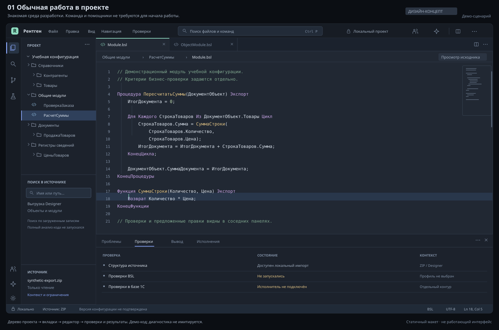
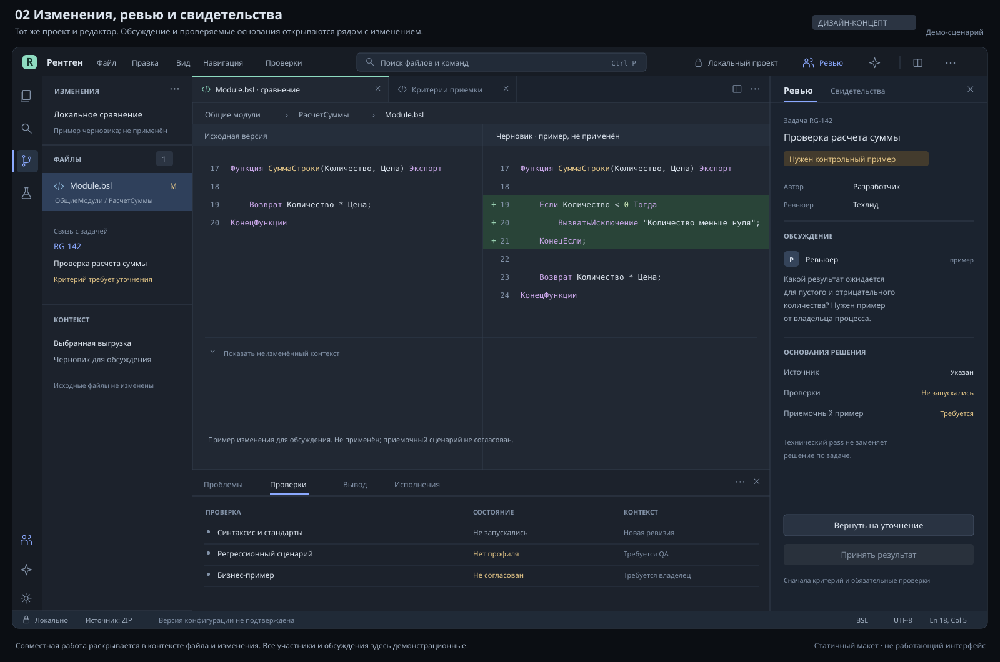
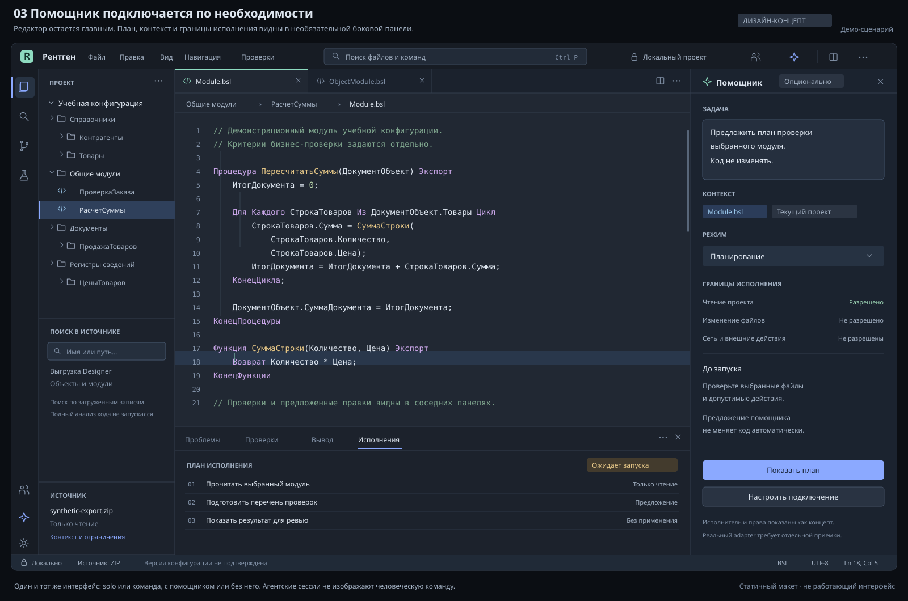

# Следующее поколение Рентгена: план разработки IDE

Срез: **6 октября 2026**. Статус: **план разработки и квалификации**.

[Главная](../../README.md) · [Общий roadmap](../../ROADMAP.md) ·
[Что доступно сейчас](READINESS.md) · [Поддержка платформ](PLATFORM-SUPPORT.md)

## К чему идём

Знакомая среда разработки 1С: проект, дерево метаданных, вкладки, редактор,
поиск, diff, проверки и отладка. Один человек и команда работают в том же
интерфейсе. AI-помощники подключаются по необходимости; ручной путь остаётся
полноценным. Сложные настройки открываются по мере задачи.

Целевой результат: разработчик проходит поддержанный цикл
«найти → изменить → проверить → обновить dev-базу → запустить → отладить»
из Рентгена, без возврата в графическое окно Конфигуратора. Платформа 1С,
её лицензии и штатные исполнительные инструменты остаются необходимыми
для соответствующих операций. Каждый такой цикл ещё предстоит доказать.

Ожидаемая польза: меньше переключений между инструментами, понятная связь
правки с исполняемой версией, воспроизводимое подключение отладчика и общий
контекст обсуждения. Это цели продукта. Ускорение, полнота замещения и качество
AI будут оцениваться отдельно на опубликованной методике.

## Первые макеты

**Статические дизайн-концепты с учебными данными. Это не снимки работающей
IDE и не возможности опубликованного выпуска.** Подписи внутри изображений
сохранены; проверки в демонстрационных сценариях не запускались.

### Обычная работа в проекте

Код в центре, проект и поиск слева, результаты снизу. Локальная работа доступна
без команды и помощника. На будущем рабочем экране нужно видеть не только
файл, но и его источник, ревизию и отношение к выбранной базе.

### Изменения и командное ревью

Изменение, задача и обсуждение рядом. Технический успех проверки не подменяет
согласованный бизнес-пример. Совместная работа людей имеет собственные роли,
права и review; количество агентных сессий не обозначает размер команды.

### Необязательный помощник

Помощник получает выбранный контекст и разрешённые действия. План, предложенная
правка и её применение различаются. Отключение помощника не убирает обычные
команды редактора, поиска, тестов и отладки.

## Состояние продукта и границы плана

| Уровень | Состояние |
| :--- | :--- |
| Опубликовано | [Core dev17](https://github.com/DmitrL-dev/1cai-public/releases/tag/core-v0.1.0-dev17) и [Companion 0.1.18](https://github.com/DmitrL-dev/1cai-public/releases/tag/companion-v0.1.18), ранний доступ / prerelease с ограниченными сценариями |
| Экспериментальная поставка | Linux x86_64: локальное состояние, история и ограниченный Rust ZIP import; границы в [PORTABLE-CORE](PORTABLE-CORE.md) и [RUST-INPUT-CORE](RUST-INPUT-CORE.md) |
| Исходники и прототипы | Более поздние проверки и отдельные компоненты не обновляют принятые пакеты. [Прототип интерфейса #72](https://github.com/DmitrL-dev/1cai-public/pull/72) не подтверждает готовность новой IDE |
| План | Привычная IDE, единый рабочий контекст, поиск, хранилище, отладка, сотрудничество людей и необязательные агенты |
| Исследование | Полное покрытие форм, ресурсов, СКД, семантического merge, восстановления и вариантов AI-архитектуры |

Наличие макета, документации стороннего компонента или зелёной сборки не
переносит функцию из плана в выпуск. Публичные обещания обновляются после
проверки конкретного сценария, ОС, версий и доставляемых артефактов.

## Первые законченные сценарии

Приоритет первых срезов: **подключение проекта и хранилища, поиск метаданных,
надёжная отладка**. Простой check/build/run нужен уже для их приёмки; широкое
покрытие сборки, тестирования и deployment расширяется позже вместе с формами,
запросами, СКД, расширениями и объединением конфигураций.

1. **Открыть проект и довести небольшую правку до dev-базы.** Выбрать исходный
   формат и базу, найти общий модуль, изменить метод, проверить, применить и
   увидеть ожидаемый результат. Синтаксическая ошибка и чужой захват дают
   понятный отказ. Вход через Git и через 1С-хранилище проверяется раздельно.
2. **Воспроизвести ошибку и доверять отладчику.** Проверить окружение, выбрать
   нужный процесс, связать breakpoint с конкретным источником, увидеть ожидаемые
   stack/watch и повторить сценарий после исправления. Неверная база, доступ,
   источник или исчезнувший процесс различаются в диагностике.
3. **Объединить изменения двух разработчиков.** Изолированные worktrees и
   dev-базы, видимый конфликт, review решения, проверенный итоговый diff.
   Независимая правка сохраняется. Потеря ответа после записи не запускает
   повторное применение вслепую.

## Потоки разработки

### A. Проверить полезность AI до выбора архитектуры

Сравнить готовую агентную архитектуру, собственный узкий Rust-компонент и
гибрид. Одинаковые задачи, доступные факты, лимиты инструментов и критерии
результата. Язык реализации сам по себе не доказывает качество рассуждения.

Первый пилот ограничен задачей вызова метода общего модуля: контекст исполнения,
`Export`, непосредственный получатель и соответствие source/runtime. Далее
нужен независимый набор известных причин с результатами до и после исправления.
Набор должен содержать недостаточные и противоречивые данные, изменившуюся
ревизию и случаи, где правильное действие заключается в дополнительной проверке.

Измерять правильность выбора следующей проверки, ложные причины, способность
пересмотреть вывод, корректный отказ от вывода, стоимость и задержку. Сравнивать
с простыми детерминированными правилами и базовой моделью на тех же входах.
Существующий synthetic gate Rust diagnostic kernel остаётся проверкой своего
компонента; он не заменяет новый независимый benchmark компетентности.
См. [узкую диагностику](NARROW-DIAGNOSTICS-PLAN.md) и
[границы текущего kernel](DIAGNOSTIC-KERNEL.md).

### B. Знакомая IDE и постепенное раскрытие сложности

Проверить оболочку на базе [Eclipse Theia](https://theia-ide.org/docs/) и развитие
текущего Companion как кандидатов. Theia пока не выбрана окончательно. Сравнить
редактор, расширения, LSP/DAP, упаковку, память, обновление, доступность и стоимость
поддержки на одном пользовательском сценарии.

Первый интерфейс: дерево проекта и метаданных, редактор, быстрый поиск, diff,
Problems, Output, Tests и Debug. Общая панель задач и настройки агентов появляются
по запросу. Прерывание операции, повторное открытие и несохранённые изменения
входят в приёмку наравне с успешным проходом.

### C. Источник, индекс и точная идентичность

Для каждого проекта зафиксировать авторитетный формат: Designer XML или EDT.
Чтение, изменение и конвертация имеют разные контракты. Неизвестные узлы и
бинарные ресурсы сохраняются без потерь. Конвертация требует round-trip проверки.

Индекс объединяет метаданные и BSL, сохраняя различие текстового совпадения,
символа, ссылки на объект, обработчика события и динамической гипотезы. У результата
есть источник, ревизия и полнота. Частичный индекс не означает отсутствие объекта.
Для BSL сначала квалифицировать [BSL Language Server](https://1c-syntax.github.io/bsl-language-server/en/),
а не воспроизводить весь его набор функций. Семантическая модель EDT и её CLI
extensions могут подключаться отдельно [S4, S5].

### D. Рабочий цикл без окна Конфигуратора

Использовать версионированные адаптеры штатных средств: Designer batch,
Designer AgentMode, `ibcmd` и EDT CLI. Выбор определяется поддержанной операцией
и измеренным результатом. Для EDT нельзя строить новый путь на устаревшем
EDT ring CLI; переход описан в официальных notes 2024.1 [S3].

Каждая команда имеет предусловия, точную цель, scope объектов, журнал стадий,
результат backend и проверку фактического результата. Код выхода 0 недостаточен
для заявления, что нужная версия исполняется. EDT GUI и CLI не должны одновременно
владеть одной workspace [S6].

Готовые DAP-адаптеры рассматриваются для повторного использования, но требуют
проверки authentication, discovery, client/server/фоновых задач, source mapping,
расширений, переподключения и лицензий [S7, S8]. HTTP health-check сам по себе
не подтверждает привязку breakpoint. Опубликованные EDT Java API показывают
точки интеграции; совместимость SDK с выбранным выпуском проверяется отдельно [S9].

### E. Совместная работа людей и управляемые агенты

Разделить read/analyze, propose, edit branch, run tests, repository lock/commit,
apply to dev и deploy. Права проекта, 1С и хранилища сохраняются. UI и агент
вызывают одни типизированные операции. Agent runtime не получает обходной путь
к записи через произвольную командную строку.

Для параллельной работы: отдельные worktrees и backend workspaces, очередь на
общую dev-базу, проверка ожидаемой ревизии перед записью и audit решений.
Перед применением повторно сверять исходное состояние. Неизвестный исход после
обрыва связи сначала выясняется чтением target. Работа одного человека без AI,
команды без AI и команды с AI проверяется на том же базовом сценарии.

### F. Расширять покрытие после отдельных проверок

Управляемые и обычные формы, запросы, СКД, печатные макеты, расширения, EPF/ERF,
обновление поставщика, полноценный build/test/deploy и восстановление получают
свои наборы примеров и критерии. Приоритет отдаётся сохранности данных и
наблюдаемому результату. Существующие [three-way](THREE-WAY-UPDATES.md),
[Designer XML](METADATA-THREE-WAY.md) и [EDT identity](EDT-IDENTITY-THREE-WAY.md)
контракты расширяются, а их уже описанные ограничения сохраняются.

## Три состояния, которые нельзя смешивать

| Состояние | Что нужно знать |
| :--- | :--- |
| Исходник / редактор | Формат, проект, ревизия, несохранённый buffer, UUID объекта и слой расширения |
| Подготовленный artifact | Из каких входов собран, каким backend, с каким digest и результатом проверок |
| Применённая конфигурация БД | Какая база и конфигурация фактически обновлены, какой результат подтверждён чтением и запуском |

Save, build и apply являются разными переходами. Платформа различает основную
конфигурацию и конфигурацию БД [S1]. `generation-id` можно использовать только
в рамках документированного смысла конкретного backend; он не объявляется
хешем всех исходников или состояния данных.

У breakpoint также должны быть requested/resolved location и состояния
pending/bound/rejected/stale. Красный маркер без подтверждённого source mapping
не означает, что выполняется текущий текст редактора.

## Матрица 24 сценариев и наблюдаемая приёмка

Все строки ниже относятся к **плану**. «Backend-кандидат» означает направление
проверки, а не уже готовую интеграцию. Полная реализация требует отдельных
исследований там, где штатного интерфейса недостаточно.

| № | Сценарий | Backend-кандидат / работа | Что должно быть доказано |
| :--- | :--- | :--- | :--- |
| 01 | Проект и 1С-хранилище | Designer + source/repository adapters | Подключение к ожидаемой базе и хранилищу; несовместимый формат или доступ дают точную причину без неявной замены конфигурации |
| 02 | Захват и помещение объектов | Repository operations | Чужой захват сохранён, scope UUID точен, потеря ответа после commit разрешается read-back |
| 03 | Git-ветки и dev-базы | Git + coordinator | Смена ветки не притворяется обновлением базы; локальные изменения и связь с worktree сохранены |
| 04 | Compare и three-way merge | Native compare/merge + semantic plan | Выбранные решения совпадают с итоговым native diff; чужие изменения не потеряны |
| 05 | Обновление поставщика | Supplier old/new/ours | Сохранены согласованные доработки, support rules и данные на учебном V1→V2 |
| 06 | Поиск всех метаданных | Incremental index | Эталонные имена, синонимы и реквизиты найдены; cold/warm latency и неполнота видимы |
| 07 | Ссылки и вызовы | LSP + metadata graph | Отличаются text hit, symbol, event и dynamic hypothesis; эталонные связи не потеряны |
| 08 | Rename | Symbol / metadata operations раздельно | Preview совпадает с diff, UUID сохранены, одноимённые посторонние символы неизменны |
| 09 | Код и диагностика | BSL-LS, EDT, native check | Источник диагностики и контекст указаны; false positive не становится автоматической правкой |
| 10 | Edit/check/build/apply/run | Platform adapters | Ошибка блокирует применение; успешный клиент исполняет ожидаемую ревизию |
| 11 | Подключение отладчика | Qualified DAP / EDT bridge | Нужный subject найден; auth, порт, база и исчезновение процесса различимы |
| 12 | Breakpoint, stack, watch | Debug source mapping | Подтверждена правильная строка и ревизия, включая extension; stale не выглядит verified |
| 13 | Управляемые формы | Form model + lossless adapter | No-op round-trip без смыслового diff; изменение элемента/события проверено native load и runtime |
| 14 | Обычные формы | Отдельное исследование редактора | Legacy-форма сохранена без порчи и запущена нужным клиентом; её поддержка не выводится из managed forms |
| 15 | Запросы | Query editor + execution adapter | Текст, параметры и типы согласованы; эталонный результат получен с заданными правами |
| 16 | СКД | Schema/settings editor | Ресурсы, вычисления, вложенные схемы и варианты сохранены; результат отчёта проверен |
| 17 | MXL и ресурсы | Registry специализированных редакторов | Неизменённые binary hashes сохранены; области, параметры и печатный результат соответствуют примеру |
| 18 | Расширения | Base + ordered extension set | Применимость и выбранный runtime-слой подтверждены, базовый объект не изменён побочно |
| 19 | EPF/ERF | External artifact pipeline | Сборка, запуск и debug относятся к новому digest; контекст базы указан |
| 20 | Тесты в IDE | YAxUnit / Vanessa adapters | Pass, fail, crash, timeout и no-tests различаются; есть переход к исходнику [S10] |
| 21 | Схема БД и восстановление | Apply + recovery workflow | Сбой после load/во время apply даёт известное состояние; восстановление данных проверено |
| 22 | Windows/Linux/macOS | Host/executor capabilities | Каждый заявленный OS/arch/toolchain маршрут принят отдельно, включая пути и кодировки |
| 23 | Люди и агенты | Roles, review, CAS | Solo/team и agent-off/on сохраняют ручной путь и не перезаписывают чужую ревизию |
| 24 | Долгие операции | Journal + reconciliation | Успех имеет postcondition; canceled и outcome-unknown переживают перезапуск без слепого retry |

## Версии и переносимость

Базовый исследовательский контур: стабильная ветка платформы **8.3.27** и
**EDT 2026.1.3**. Полный build платформы, Java, плагины и формат workspace
фиксируются в evidence конкретного запуска. В официальных notes EDT 2026.1
для ветки 8.3.27 указан минимум **8.3.27.2025** [S2].

**Платформа 8.5.4 test** и ветка **EDT 2026.2** рассматриваются отдельно.
Возможности тестовой версии не становятся требованиями или обещаниями базового
выпуска. Переход на новую стабильную версию требует повторной проверки.
Публичные источники: [EDT downloads](https://edt.1c.ru/docs/new/download.php),
[EDT 2026.2](https://v8.1c.ru/platforma/news/novoe-v-1c-edt-2026-2/),
[страница документации 8.5.4](https://its.1c.ru/db/v854doc/content/90/hdoc).

Windows, Linux и macOS являются целями поэтапной поддержки. Возможности
клиента IDE и исполнительного host учитываются отдельно. Даже если оболочка
запускается на ОС, наличие platform binary, отладки, лицензии, отмены и
восстановления должно быть проверено. Удалённый исполнитель может быть
допустимым вариантом без обязательного remote desktop, но это тоже отдельный
сценарий. [Текущая матрица Рентгена](PLATFORM-SUPPORT.md) остаётся источником
статуса; системные требования EDT не доказывают паритет нашего продукта [S11].

## Как будем принимать результат

- Искусственная конфигурация с известными объектами, ссылками и ожидаемым
  поведением; отдельные fixtures для расширений, форм, запросов и ресурсов.
- Inventory parity, no-op round-trip и минимальная правка с ожидаемым diff.
- Проверка source → artifact → applied DB → runtime с точными версиями.
- Отрицательные ветки: неверный доступ, чужой lock, stale revision, ошибка
  компиляции, частичный apply, crash и потеря ответа после записи.
- Отладка на каждой заявленной топологии и повторяемое попадание в нужную
  строку после rebuild, с проверкой stack/watch.
- Холодный/повторный старт, время поиска, индексации и edit-to-run, peak memory;
  размер корпуса, оборудование и полная методика публикуются вместе с числами.
- Отдельный benchmark AI с known-cause случаями, скрытой контрольной выборкой
  и простыми baselines. Правильный отказ от недоказанного вывода учитывается.
- Review, CI точного commit, проверка установленных артефактов и явный список
  ограничений. Локальный успех или сборка не заменяют native acceptance.

Даты выпуска и выигрыш в скорости заранее не обещаются. Строка становится
доступной возможностью после публикации версии, предусловий, воспроизводимого
сценария и результатов. Заявление о полном замещении допустимо только после
покрытия всей заявленной роли разработчика, включая legacy и восстановление.

## Публичные основания

Это собственный план по результатам анализа открытой документации и исходников.
Документация устанавливает наличие интерфейса; его поведение в Рентгене проверяется
отдельно. Подробности платформы доступны по ссылкам на первоисточники. При выборе
зависимостей проверяются лицензии конкретных версий; MIT Рентгена не меняет
условия платформы или компонентов.

- **S1.** [1C:Enterprise Developer Guide 8.3.27](https://1c-dn.com/library/tutorials/1c_enterprise_developer_guide_8_3_27/) и [Administrator Guide, file mode 8.3.27](https://1c-dn.com/library/tutorials/1c_enterprise_administrator_guide_file_mode_8_3_27/): модель конфигурации и штатные исполнительные средства.
- **S2.** [Официальные notes EDT 2026.1 / 2026.1.3](https://edt.1c.ru/docs/new/versiya-2026-1/): версии платформы, Git и развитие compare/support.
- **S3.** [EDT 2024.1](https://edt.1c.ru/docs/new/versiya-2024-1/) и [EDT 2025.1](https://edt.1c.ru/docs/new/versiya-2025-1/): текущий CLI и операции с информационной базой.
- **S4.** [EDT CLI scripts](https://edt.1c.ru/dev/ru/docs/plugins/dev/cli-script/) и [CLI extensions](https://edt.1c.ru/dev/ru/docs/plugins/dev/cli/): автоматизация и расширяемые команды.
- **S5.** [Модель EDT](https://edt.1c.ru/dev/ru/docs/plugins/dev/model/) и [семантическая BSL-модель](https://edt.1c.ru/dev/ru/docs/plugins/dev/lang/bsl-model/): отдельные сервисы модели и языка.
- **S6.** [EDT 2023.2](https://edt.1c.ru/docs/new/versiya-2023-2/): ограничения одновременного доступа к workspace; [публичный пример EDT-адаптера](https://github.com/yellow-hammer/vscode-1c-platform-tools/blob/main/docs/edt.md).
- **S7.** [BSL Language Server](https://1c-syntax.github.io/bsl-language-server/en/) и [исходники](https://github.com/1c-syntax/bsl-language-server): reuse языка и диагностики.
- **S8.** [onec-debug-adapter](https://github.com/yellow-hammer/onec-debug-adapter), [vsc-bsl-dap](https://github.com/yukon39/vsc-bsl-dap) и [1C Platform Tools](https://github.com/yellow-hammer/vscode-1c-platform-tools): кандидаты интеграции, не доказательство runtime-приёмки Рентгена.
- **S9.** [EDT runtime debug API 2025.2](https://edt.1c.ru/dev/edt/2025.2/apidocs/com/_1c/g5/v8/dt/debug/core/runtime/client/IRuntimeDebugClient.html), [form model 2025.2](https://edt.1c.ru/dev/edt/2025.2/apidocs/com/_1c/g5/v8/dt/form/model/FormPackage.Literals.html) и [form XML export 2024.2](https://edt.1c.ru/dev/edt/2024.2/apidocs/com/_1c/g5/v8/dt/form/export/xml/package-summary.html): опубликованные API разных версий, совместимость ещё квалифицируется.
- **S10.** [YAxUnit](https://bia-technologies.github.io/yaxunit/) и [Vanessa-runner](https://github.com/vanessa-opensource/vanessa-runner): раздельные уровни тестирования и запуска.
- **S11.** [Системные требования EDT](https://edt.1c.ru/docs/intro/requirements.php): ограничения версий и ОС самого EDT.
- **S12.** [Eclipse Theia](https://theia-ide.org/docs/): кандидат расширяемой оболочки, ещё не выбранная архитектура Рентгена.

[Общий порядок работ](../../ROADMAP.md) · [Правила участия](../../CONTRIBUTING.md) ·
[Сообщить о воспроизводимом сценарии](https://github.com/DmitrL-dev/1cai-public/issues)
